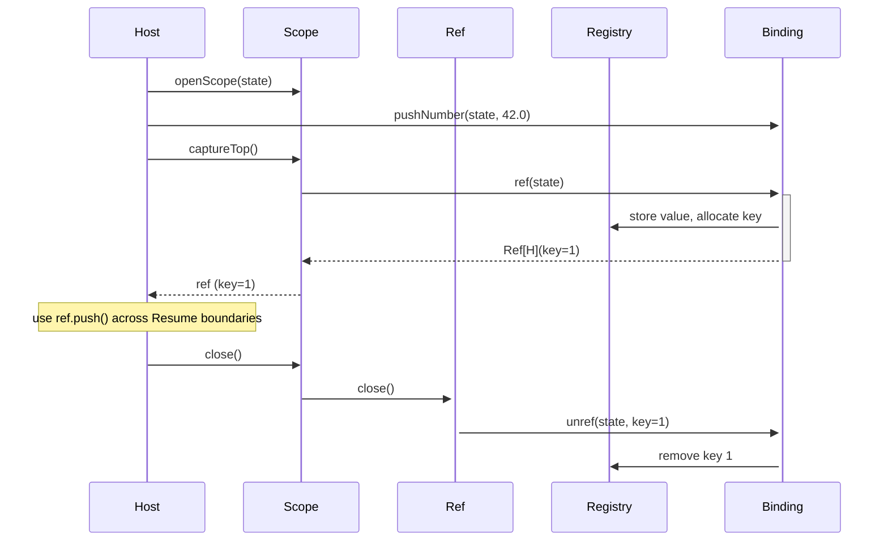

# Core Abstractions Reference

**Date:** 2026-06-10  
**Module:** `luau-scala / core`  
**Status:** Living reference — verified against source as of commit `a10109f`

---

## Table of Contents

1. [Overview and Source Layout](#1-overview-and-source-layout)
2. [Binding\[H\] — the Backend Contract](#2-bindingh--the-backend-contract)
3. [LuaValue, LuaType, and LuaError](#3-luavalue-luatype-and-luaerror)
4. [Ref and Scope — Lifetime Model](#4-ref-and-scope--lifetime-model)
5. [NativeFn and NativeFnResult — the Tristate](#5-nativefn-and-nativefnresult--the-tristate)
6. [Async Primitive — Resume and Cancel](#6-async-primitive--resume-and-cancel)
7. [ResumeResult — the Resume Boundary Outcome](#7-resumeresult--the-resume-boundary-outcome)
8. [Codec Layer](#8-codec-layer)
9. [Test Doubles — the fake/* Package](#9-test-doubles--the-fake-package)
10. [JVM/JS Source-Sharing Mechanism](#10-jvmjs-source-sharing-mechanism)
11. [Known Limitations and Open Issues](#11-known-limitations-and-open-issues)

---

## 1. Overview and Source Layout

The `luau.core` subsystem is a platform-agnostic abstraction layer between the Luau Runtime (the upstream Roblox C++ engine embedded via the Shim) and higher-level Host code. It defines the entire contract for interacting with a Luau state: state lifecycle, Resume boundary, stack operations, Ref management, Codec (Encoder/Decoder), Sink, and Scope.

The design is typeclass-polymorphic over a handle type `H`. Callers never know whether `H` is a JVM `MemorySegment` (Panama backend), a JS `Int` (WASM backend), or a pure in-process `FakeState` (testing). All types live in the `luau.core` package or its `luau.core.codec` subpackage.

**There are no platform-specific imports in the core source tree** — no `java.lang.foreign.*`, no `scala.scalajs.*` — with the important caveat that `java.nio.charset.StandardCharsets` is used in three files (see [Section 10](#10-jvmjs-source-sharing-mechanism)).

### Directory structure

```
core/
├── jvm/
│   ├── src/luau/core/
│   │   ├── Binding.scala
│   │   ├── Ref.scala
│   │   ├── Scope.scala
│   │   ├── LuaValue.scala
│   │   ├── LuaType.scala
│   │   ├── LuaError.scala
│   │   ├── NativeFn.scala
│   │   ├── NativeFnResult.scala
│   │   ├── ResumeResult.scala
│   │   ├── Async.scala
│   │   ├── codec/
│   │   │   ├── LuauEncoder.scala
│   │   │   ├── LuauDecoder.scala
│   │   │   ├── Sink.scala
│   │   │   ├── SinkImpl.scala
│   │   │   ├── package.scala
│   │   │   └── instances/package.scala
│   │   └── fake/
│   │       ├── FakeBinding.scala
│   │       ├── FakeState.scala
│   │       └── FakeTable.scala
│   └── test/src/luau/core/
│       ├── codec/CodecSpec.scala
│       ├── NativeFnResultSpec.scala
│       └── RefScopeSpec.scala
└── js/
    └── src -> ../jvm/src   ← filesystem symlink (see Section 10)
```

The Mill build defines `core.jvm` as a `LuauCrossPlatformModule` and `core.js` as a `LuauCrossPlatformJSModule` (`build.mill:27-40`). The `wasm` module depends on `core.js` via `moduleDeps = Seq(core.js)` (`build.mill:54`).

---

## 2. Binding\[H\] — the Backend Contract

**File:** `core/jvm/src/luau/core/Binding.scala`

`Binding[H]` is the central trait that every Binding backend must implement. It is parameterized over a single handle type `H`, which is the opaque identity of a Luau state on a particular platform. The trait is deliberately narrow: it exposes only what the Luau C API directly provides, without abstracting over threading, scheduling, or effect management.

### Full method table

| Group | Signature | Description |
|-------|-----------|-------------|
| **State lifecycle** | `newState(): H` | Allocates a new Luau state; returns its handle |
| | `closeState(state: H): Unit` | Destroys the state and frees all associated memory |
| **Script loading** | `compileAndLoad(state: H, source: IArray[Byte], chunkname: String): Either[LuaError, Unit]` | Compiles Luau bytecode from `source` and loads the resulting chunk onto the stack (as a callable function) |
| **Resume boundary** | `resume(thread: H, nargs: Int): ResumeResult` | The sole sanctioned entry point for executing Luau code from the Host; see [Section 7](#7-resumeresult--the-resume-boundary-outcome) |
| **Thread lifecycle** | `newThread(state: H): H` | Creates a new Luau coroutine thread handle |
| **Push operations** | `pushNil(state: H): Unit` | Pushes nil |
| | `pushCopy(state: H, idx: Int): Unit` | Pushes a copy of the value at `idx` |
| | `pushBoolean(state: H, value: Boolean): Unit` | Pushes a boolean |
| | `pushNumber(state: H, value: Double): Unit` | Pushes a number |
| | `pushBytes(state: H, bytes: IArray[Byte]): Unit` | Pushes an opaque byte string |
| | `pushString(state: H, value: String): Unit` | Pushes a UTF-8-encoded string |
| | `pushFunction(state: H, fnId: Int): Unit` | Pushes a previously registered Native function by ID |
| | `pushRef(state: H, registry: Int): Unit` | Pushes the value stored at `registry` key (used by `Ref.push()`) |
| **Read operations** | `typeAt(state: H, idx: Int): LuaType` | Returns the `LuaType` of the value at stack index `idx`; non-raising |
| | `toNumber(state: H, idx: Int): Option[Double]` | Coerces to `Double`; `None` if not a number |
| | `toBoolean(state: H, idx: Int): Boolean` | Returns boolean interpretation (never raises) |
| | `toBytes(state: H, idx: Int): Option[IArray[Byte]]` | Returns raw bytes if value is a string; `None` otherwise |
| | `isNil(state: H, idx: Int): Boolean` | Default: `typeAt(state, idx) == LuaType.Nil` |
| | `stackTop(state: H): Int` | Returns current stack depth |
| | `setStackTop(state: H, idx: Int): Unit` | Shrinks or extends the stack to `idx` |
| | `pop(state: H, n: Int): Unit` | Default: `setStackTop(state, -n - 1)` |
| **Table operations** | `newTable(state: H): Unit` | Creates a new empty table and pushes it |
| | `rawGet(state: H, tableIdx: Int): Unit` | Pops key, pushes `table[key]` |
| | `rawSet(state: H, tableIdx: Int): Unit` | Pops value and key, sets `table[key] = value` |
| | `setArray(state: H, tableIdx: Int, n: Int): Unit` | Pops value, sets `table[n]` (1-based array slot) |
| | `getArray(state: H, tableIdx: Int, n: Int): Unit` | Pushes `table[n]` (1-based array slot) |
| | `rawLen(state: H, idx: Int): Long` | Returns raw length of table or string at `idx` |
| **Registry (Ref)** | `ref(state: H): Ref[H]` | Pops top of stack, stores in the Luau registry, returns a `Ref` |
| | `unref(state: H, key: Int): Unit` | Releases the registry slot at `key` |
| **Native functions** | `registerNativeFn(state: H, fn: NativeFn[H]): Unit` | Registers `fn` and pushes the resulting callable onto the stack |
| **Globals** | `getGlobal(state: H, name: String): Unit` | Pushes the value of global `name` |
| | `setGlobal(state: H, name: String): Unit` | Pops top and sets it as global `name` |
| **Scope** | `openScope(state: H): Scope[H]` | Default: `Scope(this, state)` — creates an RAII Ref container |
| **Library loading** | `openLibs(state: H, mask: Int): Unit` | Opens standard Luau libraries according to `mask` |
| | `sandbox(state: H): Unit` | Sandboxes the state (restricts library access) |

All read operations (those returning `Option[_]` or `Boolean`) are explicitly non-raising. An invalid stack index or type mismatch returns `None` or `false`; it never throws. This is a design invariant: Native functions must use these accessors to read their arguments.

### Design note: H as an opaque identity

The handle type `H` is intentionally left abstract. The Panama backend uses `java.lang.foreign.MemorySegment`; the WASM backend uses `Int` (a 32-bit linear-memory pointer). Test code uses `FakeState`. Because `Binding[H]` never inspects `H` — it only passes it back to its own methods — all platform-specific knowledge stays in the concrete implementation.

---

## 3. LuaValue, LuaType, and LuaError

### LuaValue — the value ADT

**File:** `core/jvm/src/luau/core/LuaValue.scala`

`LuaValue` is an open trait (not `sealed`) that represents Lua values crossing the Resume boundary in Codec results and `NativeFnResult.Fail` payloads.

```scala
trait LuaValue

object LuaValue:
  case object Nil extends LuaValue
  sealed abstract class Bool(val value: Boolean) extends LuaValue
  case object True extends Bool(true)
  case object False extends Bool(false)
  object Bool:
    def apply(b: Boolean): Bool = if b then True else False
    def unapply(b: Bool): Some[Boolean] = Some(b.value)
  final case class Number(value: Double) extends LuaValue
  final case class LuaString(bytes: IArray[Byte]) extends LuaValue
  object LuaString:
    def fromUtf8(s: String): LuaString = ...    // uses java.nio.charset.StandardCharsets.UTF_8
  final class LuaRef(val ref: Ref[?]) extends LuaValue
  def isTruthy(v: LuaValue): Boolean = v match
    case Nil | False => false
    case _           => true
```

Key points:

- **`Bool`** is a sealed abstract class with two singleton subclasses (`True`, `False`). The `Bool.apply` factory creates the correct singleton. `Bool.unapply` enables pattern matching on the underlying `Boolean` value.
- **`LuaString`** stores raw bytes rather than a Scala `String` because Luau strings are byte sequences and may not be valid UTF-8. Use `LuaString.fromUtf8` for string literals, or push raw bytes via `pushBytes` for arbitrary data.
- **`LuaRef`** wraps a `Ref[?]` and allows passing an already-pinned Luau object as an error payload. It **cannot** be used as a table key — this is enforced at runtime by `SinkImpl.pushKey` and `WasmSink.pushKey` (see [Section 8](#8-codec-layer), ADR-0006).
- **`isTruthy`** follows Lua semantics: only `Nil` and `False` are falsy; everything else (including `Number(0.0)`) is truthy.

### LuaType — the type tag enum

**File:** `core/jvm/src/luau/core/LuaType.scala`

```scala
enum LuaType(val luaCode: Int):
  case None     extends LuaType(-1)   // not a valid Lua type (invalid index)
  case Nil      extends LuaType(0)
  case Boolean  extends LuaType(1)
  case Number   extends LuaType(3)    // note: 2 is LUA_TLIGHTUSERDATA, absent here
  case String   extends LuaType(4)
  case Table    extends LuaType(5)
  case Function extends LuaType(6)
  case Userdata extends LuaType(7)
  case Thread   extends LuaType(8)
```

`LuaType.fromCode(code: Int): LuaType` performs a linear search through `values` and throws `IllegalArgumentException` on an unrecognized code. There is no silent coercion.

Note the gap at code 2: `LUA_TLIGHTUSERDATA` from the standard C API is not represented in this enum. The Shim does not expose light userdata to the Host, so the code is legitimately absent. However, `WasmBinding.typeAt` maps code `2` to `LuaType.Nil` (`wasm/src/luau/wasm/WasmBinding.scala:111`) — see [Section 11](#11-known-limitations-and-open-issues) for details on the `typeAt` mapping table.

### LuaError — the typed Luau error

**File:** `core/jvm/src/luau/core/LuaError.scala`

```scala
final case class LuaError(message: String, level: LuaError.Level)
  extends Throwable(message, null, true, false)

object LuaError:
  enum Level:
    case Runtime
    case Memory
    case Handler
  def runtime(msg: String): LuaError = LuaError(msg, Level.Runtime)
  def memory(msg: String): LuaError  = LuaError(msg, Level.Memory)
```

`LuaError` is a `Throwable` with `writableStackTrace = false` (the fourth argument to the `Throwable` constructor). This means no JVM stack trace is captured at construction time. `LuaError` is a control-flow signal, not a diagnostic exception; capturing a 30-frame stack trace on every Lua error would be expensive and misleading.

`Level.Handler` is present in the enum but has no factory method in the companion — it is reserved for Lua error handler errors (errors raised inside the error handler function itself).

---

## 4. Ref and Scope — Lifetime Model

### Ref\[H\] — the Host-held registry handle

**File:** `core/jvm/src/luau/core/Ref.scala`

A `Ref[H]` is a stable Host-held handle to a Luau-heap object stored in the Luau registry. It lets the Host reference tables and functions across Resume boundary crossings without keeping them on the stack.

```scala
final class Ref[H] private[core] (
  private[core] val state:    H,
  private[core] val registry: Int,
  private[core] val binding:  Binding[H],
  private[core] val origin:   String,
) extends AutoCloseable:
  @volatile private var closed = false

  def push(): Unit = ...        // requires !closed; calls binding.pushRef(state, registry)
  override def close(): Unit =  // idempotent; calls binding.unref(state, registry)
  def isClosed: Boolean = closed
  def registryKey: Int = registry
```

**Constructor access:** The primary constructor is `private[core]`, so only code within the `luau.core` package can create `Ref` instances. The sole factory is `Binding.ref(state: H): Ref[H]`, which pops the top of the stack, stores the value in the Luau registry, and returns the `Ref`. There is an additional package-private factory in `Ref`'s companion:

```scala
object Ref:
  private[luau] def apply[H](state: H, registry: Int, binding: Binding[H], origin: String): Ref[H]
```

This `private[luau]` access exists so that `WasmBinding` (in package `luau.wasm`) can construct `Ref[Int]` values directly after calling `_lx_ref` on the WASM side (`wasm/src/luau/wasm/WasmBinding.scala:211`).

**`@volatile closed` flag:** The closed flag is `@volatile` to allow safe publication when `Ref.close()` is called from one thread and `isClosed` is checked from another. The idiomatic owner is a `scala.util.Using` block or a higher-level effect system `Resource`. `close()` is idempotent: calling it twice is safe.

**`push()` contract:** Calling `push()` on a closed `Ref` throws `IllegalArgumentException` immediately. This is intentional — a use-after-close is a programming error.

**`origin` field:** `genOrigin()` in the companion captures the caller's file and line number from the JVM stack trace (`Ref.scala:35-39`). This is stored in `origin` for leak diagnostics. It is the call site of `binding.ref(state)`, not of the `Ref` constructor itself.

**Lifetime rules (from CONTEXT.md):**
- A `Ref` is released only by explicit `close()`, by the `Scope` that owns it closing, or by the state tearing down.
- A leaked `Ref` pins its Luau object (preventing GC) until the state closes.
- Never rely on JVM garbage collection to release a `Ref` — there is no finalizer.

### Scope\[H\] — LIFO Ref container

**File:** `core/jvm/src/luau/core/Scope.scala`

```scala
class Scope[H](
  private val binding: Binding[H],
  private val state:   H,
) extends AutoCloseable:
  private val owned: mutable.ArrayDeque[Ref[H]] = mutable.ArrayDeque.empty

  def captureTop(): Ref[H]         // calls binding.ref(state), owns the result
  def own(r: Ref[H]): r.type       // takes an externally-created Ref into ownership
  override def close(): Unit       // drains owned deque in LIFO order
```

`Scope` is a confined region that owns the `Ref`s created inside it and closes them all on exit. `captureTop()` calls `binding.ref(state)` (which pops the top of the stack and pins the value) and records the resulting `Ref` in its internal `ArrayDeque`. `close()` drains the deque with `removeLast()`, giving strict LIFO release order.

`own(r)` allows adopting a `Ref` that was created outside the scope (for example, by a helper function) into the scope's ownership, ensuring it is released when the scope exits.

`openScope(state: H): Scope[H]` is a default method on `Binding` that constructs a `Scope` directly:

```scala
// Binding.scala:95
def openScope(state: H): Scope[H] = Scope(this, state)
```

Backends may override this (for example, the Panama backend can return an `Arena`-backed scope).

### Lifetime diagram



---

## 5. NativeFn and NativeFnResult — the Tristate

### NativeFn\[H\]

**File:** `core/jvm/src/luau/core/NativeFn.scala`

```scala
type NativeFn[H] = (state: H, nargs: Int) => NativeFnResult
```

A Native function is any Scala function exposed to Luau scripts. It receives the state handle and the number of arguments on the stack, and returns one of three outcomes. The named parameters (`state`, `nargs`) are syntactic documentation — they carry no runtime effect in Scala 3 type aliases.

### NativeFnResult — the three outcomes

**File:** `core/jvm/src/luau/core/NativeFnResult.scala`

```scala
enum NativeFnResult:
  case Return(nResults: Int)
  case Fail(value: LuaValue)
  case Suspend(register: Resume => Cancel)
```

**`Return(nResults: Int)`** — the function has pushed `nResults` values onto the stack. The Shim returns these to the calling Lua code as the function's results.

**`Fail(value: LuaValue)`** — the function signals a Lua error. The Shim raises the error in pure C (no JVM exceptions cross the FFI boundary — see CONTEXT.md). The `LuaValue` payload becomes the Lua error object. `LuaError` from a failed Codec decode is typically wrapped in a `Fail(LuaValue.LuaString.fromUtf8(err.message))`.

**`Suspend(register: Resume => Cancel)`** — the Async primitive. The function does not return a value immediately; instead it wires an asynchronous operation against a one-shot callback (see [Section 6](#6-async-primitive--resume-and-cancel)). The Shim yields the Luau coroutine in pure C, parking it until the callback fires. This case is what enables the Scheduler's cooperative execution model.

The tristate is the complete interface between Host Scala code and the Shim's upcall mechanism. There is no fourth outcome; a Native function can only return results, raise an error, or suspend.

---

## 6. Async Primitive — Resume and Cancel

**File:** `core/jvm/src/luau/core/Async.scala`

```scala
opaque type Resume = Either[LuaError, LuaValue] => Unit

object Resume:
  def apply(f: Either[LuaError, LuaValue] => Unit): Resume = f
  extension (r: Resume)
    def complete(result: Either[LuaError, LuaValue]): Unit = r(result)
    def succeed(v: LuaValue): Unit = r(Right(v))
    def fail(e: LuaError): Unit    = r(Left(e))

opaque type Cancel = () => Unit

object Cancel:
  val noop: Cancel = () => ()
  def apply(f: () => Unit): Cancel = f
  extension (c: Cancel)
    def cancel(): Unit = c()
```

`Resume` and `Cancel` are opaque types. Their underlying representations are functions, but outside of `Async.scala` they are opaque: callers cannot accidentally invoke them without the extension API. This prevents confusion between `resume` (the completion callback) and `Binding.resume` (the Resume boundary).

### Usage in the Async primitive

When a `NativeFn` returns `Suspend(register)`, the Shim stores the callback wire-up and yields the coroutine. The Host calls `register(resume)` where `resume` is a one-shot callback provided by the Scheduler. `register` wires the async operation (a timer, IO, child Task result) and returns a `Cancel` for teardown in case the Task is cancelled.

```scala
// Example: a Native function that suspends until a callback fires
NativeFnResult.Suspend { resume =>
  val handle = asyncSystem.schedule(delay = 100.ms) {
    resume.succeed(LuaValue.Nil)
  }
  Cancel(() => handle.cancel())
}
```

**Thread-safety contract:** Calling `resume` only *enqueues* onto the Run queue; it never resumes the coroutine inline. This is essential for the Driver model — the state may be on a different thread when the callback fires.

**`Cancel.noop`** is the zero value for a cancellation that has no meaningful teardown. Use it when the async operation cannot be cancelled (for example, a one-shot network request already in-flight).

---

## 7. ResumeResult — the Resume Boundary Outcome

**File:** `core/jvm/src/luau/core/ResumeResult.scala`

```scala
enum ResumeResult:
  case Returned(nresults: Int)
  case Yielded(nresults: Int)
  case Error(error: LuaError)
```

Every call to `Binding.resume(thread, nargs)` returns exactly one of these three cases. This is the Resume boundary: all Luau execution is gated through it, and all outcomes come back through it. The Host never calls `lua_pcall` directly.

**`Returned(nresults: Int)`** — the coroutine ran to completion (or the initial script chunk returned). `nresults` values are on the top of the thread's stack.

**`Yielded(nresults: Int)`** — the coroutine yielded (via `coroutine.yield`, `task.wait`, or the Async primitive's C-level yield). The coroutine is still alive. The Scheduler may re-resume it later. `nresults` describes the yield payload on the stack.

**`Error(error: LuaError)`** — the coroutine raised an error that propagated to the Resume boundary. The error message is in `error.message`. The error level is in `error.level`. No stack trace is attached (see [Section 3](#3-luavalue-luatype-and-luaerror), `LuaError`).

The distinction between `Returned` and `Yielded` is critical: `Returned` means the Task is done and its resources can be released; `Yielded` means the Task is parked and will be re-resumed.

---

## 8. Codec Layer

The Codec layer provides compile-time–safe marshalling between Scala types and Luau values. It is structured as two typeclasses — `LuauEncoder[A]` (Host → Luau) and `LuauDecoder[A]` (Luau → Host) — plus a `Sink[H]` abstraction that decouples encoding from the concrete Binding backend.

### Design principles (ADR-0006)

Encoding always copies: Luau owns its copy of the data; the Host owns the original; nothing is shared. Encoders write to a `Sink` (a streaming push protocol) rather than building an intermediate value tree, keeping the copy count to one. `LuaRef` cannot be used as a table key (enforced at runtime in `SinkImpl.pushKey`).

### LuauEncoder\[A\]

**File:** `core/jvm/src/luau/core/codec/LuauEncoder.scala`

```scala
trait LuauEncoder[A]:
  def encode[H](value: A, sink: Sink[H]): Unit
```

`encode` is polymorphic over `H` — the encoder never knows which backend it is writing to. It only calls methods on `Sink[H]`.

**Provided given instances:**

| Type | Encoding |
|------|----------|
| `Unit` | `pushNil()` |
| `Boolean` | `pushBoolean(value)` |
| `Double` | `pushNumber(value)` |
| `Int` | `pushNumber(value.toDouble)` |
| `Long` | `pushNumber(value.toDouble)` — precision loss possible for values > 2^53 |
| `Float` | `pushNumber(value.toDouble)` |
| `String` | `pushString(value)` — UTF-8 encoding via `Sink.pushString` default implementation |
| `IArray[Byte]` | `pushBytes(value)` |
| `Array[Byte]` | `pushBytes(IArray.unsafeFromArray(value))` |
| `Option[A]` | `None` → `pushNil()`; `Some(a)` → encode `a` |
| `Seq[A]`, `List[A]`, `Array[A]`, `Vector[A]` | 1-indexed Lua table: `beginTable(); for each element: pushArrayValue(i, elem); endTable()` |
| `Map[String, V]` | String-keyed Lua table: `beginTable(); for (k,v): pushField(k, v); endTable()` |

**Case class derivation** (`LuauEncoder.derived[A]`): uses `Mirror.ProductOf[A]` to iterate over field labels and encoders. Each field is written as a named table key using `pushKey(LuaValue.LuaString.fromUtf8(label))` followed by `pushValue(fieldValue)`. The resulting Lua table has string keys matching the Scala field names.

### LuauDecoder\[A\]

**File:** `core/jvm/src/luau/core/codec/LuauDecoder.scala`

```scala
trait LuauDecoder[A]:
  def decode[H](binding: Binding[H], state: H, idx: Int): Either[LuaError, A]
```

Unlike `LuauEncoder`, the decoder receives the full `Binding[H]` and `state` because reading from the stack may require additional operations (pushing a key, calling `rawGet`, etc.).

**Provided given instances:**

| Type | Decoding |
|------|----------|
| `Unit` | Succeeds if `isNil(idx)`; otherwise `Left(LuaError)` |
| `Boolean` | `toBoolean(idx)` — always succeeds (Lua boolean coercion) |
| `Double` | `toNumber(idx).toRight(...)` |
| `Int` | `toNumber(idx).map(_.toInt).toRight(...)` |
| `Long` | `toNumber(idx).map(_.toLong).toRight(...)` |
| `IArray[Byte]` | `toBytes(idx).toRight(...)` |
| `String` | `toBytes(idx)` then `new String(..., StandardCharsets.UTF_8)`; errors on invalid UTF-8 |
| `Option[A]` | `None` on nil; `Some(decode[A](idx))` otherwise |
| `Seq[A]` | Iterates `getArray(idx, 1)`, `getArray(idx, 2)`, ... until `isNil(-1)` |
| `Map[String, V]` | **Stub** — always returns `Right(Map.empty)`; requires `Binding.tableNext` (not yet implemented) |

**Case class derivation** (`LuauDecoder.derived[A]`): reads a Lua table at `idx`. For each field label, pushes the label string and calls `rawGet(idx)` to read the field value, then delegates to the corresponding `LuauDecoder`. Returns `Left(LuaError)` on the first field decode failure.

### Sink\[H\]

**File:** `core/jvm/src/luau/core/codec/Sink.scala`

```scala
trait Sink[H]:
  val binding: Binding[H]
  val state:   H

  def pushNil(): Unit
  def pushBoolean(value: Boolean): Unit
  def pushNumber(value: Double): Unit
  def pushBytes(bytes: IArray[Byte]): Unit
  def pushString(value: String): Unit    // default: pushBytes(UTF-8 bytes)

  def beginTable(): Unit
  def endTable(): Unit

  def pushKey(key: LuaValue): Unit
  def pushValue[A: LuauEncoder](value: A): Unit
  def pushArrayValue[A: LuauEncoder](n: Int, value: A): Unit
  def pushField[A: LuauEncoder](name: String, value: A): Unit   // default: pushKey + pushValue
```

`Sink` is a streaming write target. Encoders call `beginTable()`/`endTable()` to demarcate table boundaries, `pushKey`/`pushValue` for hash-part entries, and `pushArrayValue` for array-part entries. This protocol is intentionally low-level to remain single-copy: no intermediate representation is created.

The `Sink` trait holds `binding` and `state` as `val` members (not abstract `def`), making them accessible to callers who need to drop down to raw `Binding` operations within an encoder.

### SinkImpl\[H\]

**File:** `core/jvm/src/luau/core/codec/SinkImpl.scala`

`SinkImpl[H]` is the default `Sink[H]` implementation, used on both JVM (via the `pushEncoded` extension method) and as a reference for platform-specific sinks.

```scala
final class SinkImpl[H](val binding: Binding[H], val state: H) extends Sink[H]:
  private var depth: Int = 0

  def beginTable(): Unit   = binding.newTable(state); depth += 1
  def endTable(): Unit     = require(depth > 0, ...); depth -= 1
  def pushKey(key: LuaValue): Unit  // dispatches on LuaValue; throws on LuaRef
  def pushValue[A: LuauEncoder](value: A): Unit   // encode then rawSet(state, -3)
  def pushArrayValue[A: LuauEncoder](n: Int, value: A): Unit  // encode then setArray(state, -2, n)
```

The `depth` counter tracks beginTable/endTable balance and enforces that `endTable` is not called without a matching `beginTable`. Note that `pushValue` and `pushArrayValue` do not check `depth > 0` before calling `rawSet`/`setArray` — calling them outside a `beginTable`/`endTable` pair will silently corrupt the stack.

The WASM backend has its own `WasmSink` (`wasm/src/luau/wasm/WasmSink.scala`) that mirrors `SinkImpl` semantics for the `Int` handle type. `WasmSink` does not maintain a depth counter (`endTable` is a no-op there).

### Codec extension methods

**File:** `core/jvm/src/luau/core/codec/package.scala`

```scala
extension [H](b: Binding[H])
  def pushEncoded[A: LuauEncoder](state: H, value: A): Unit
  def decodeAt[A: LuauDecoder](state: H, idx: Int): Either[LuaError, A]
```

These two methods are the primary entry points. `pushEncoded` creates a `SinkImpl` and calls the encoder. `decodeAt` delegates to the decoder's `decode` method.

### Instances re-export

**File:** `core/jvm/src/luau/core/codec/instances/package.scala`

```scala
package luau.core.codec.instances
export luau.core.codec.LuauEncoder.given
export luau.core.codec.LuauDecoder.given
```

Import `luau.core.codec.instances.*` to bring all `given` encoder and decoder instances into scope without importing the entire `luau.core.codec` package. This is the recommended import in application code.

---

## 9. Test Doubles — the fake/* Package

The `luau.core.fake` package provides pure in-process test doubles that implement `Binding[FakeState]`. No Shim, no Panama, no WASM — all state is ordinary JVM heap objects. This makes unit tests fast, deterministic, and portable.

### FakeState

**File:** `core/jvm/src/luau/core/fake/FakeState.scala`

```scala
final class FakeState:
  val stack:     mutable.ArrayDeque[LuaValue]
  val registry:  mutable.Map[Int, LuaValue]
  val globals:   mutable.Map[String, LuaValue]
  val nativeFns: mutable.Map[Int, NativeFn[FakeState]]

  def allocRegKey(): Int     // monotonically increasing registry key counter
  def allocFnId():   Int     // monotonically increasing function ID counter
  def isClosed:      Boolean
  def markClosed():  Unit

  def stackIdx(idx: Int): Int    // converts 1-based positive and negative indices to 0-based
  def valueAt(idx: Int): LuaValue  // returns Nil on out-of-bounds (never raises)
```

`stackIdx` implements Lua stack index semantics: positive indices are 1-based from the bottom (`idx - 1`); negative indices are relative to the top (`stack.size + idx`). `valueAt` is explicitly non-raising: an out-of-bounds index returns `LuaValue.Nil` rather than throwing.

### FakeBinding

**File:** `core/jvm/src/luau/core/fake/FakeBinding.scala`

`FakeBinding` is a Scala `object` (singleton) that implements `Binding[FakeState]`. Its behavior matches the `Binding` contract closely:

- **`compileAndLoad`** pushes `Nil` (no actual compilation). The chunk is not executable.
- **`resume`** always returns `ResumeResult.Returned(0)` — it does not actually execute Lua code.
- **`registerNativeFn`** allocates an `fnId`, stores the function in `state.nativeFns`, and calls `pushFunction(state, fnId)` which pushes `Nil` (a stub — the function is not actually callable from Lua in `FakeState`).
- **`typeAt`** maps `FakeTable` instances to `LuaType.Table` and `LuaValue.LuaRef` to `LuaType.Table` (treating them as opaque tables for type-checking purposes).
- **`unref`** guards against calling on a closed state: `if !state.isClosed then state.registry.remove(key)` (`FakeBinding.scala:128`).

### FakeTable

**File:** `core/jvm/src/luau/core/fake/FakeTable.scala`

```scala
final class FakeTable extends LuaValue:
  val map: mutable.Map[LuaValue, LuaValue]

  def rawGet(key: LuaValue): LuaValue  // returns Nil on missing key
  def rawSet(key: LuaValue, value: LuaValue): Unit  // removes key on Nil assignment
  def size: Int
```

`FakeTable` is both a `LuaValue` and a mutable map, so it can live directly on the `FakeState` stack. `rawSet` removes the key when `value == LuaValue.Nil`, matching Lua table semantics (assigning nil to a key is equivalent to deleting it).

`FakeBinding.setArray` and `getArray` use `LuaValue.Number(n.toDouble)` as the key for array-slot `n`. This means `setArray(state, tableIdx, 1)` stores at key `Number(1.0)` and `getArray(state, tableIdx, 1)` retrieves from key `Number(1.0)` — the same key type, so the round-trip works correctly for numeric slot access.

### Test suites

**`CodecSpec`** (`core/jvm/test/src/luau/core/codec/CodecSpec.scala`): munit suite testing encode/decode round-trips for all primitive types, `Option`, `Seq`, `Map`, and case class derivation using `FakeBinding`. Note that the test at line 94 asserts `decoded.contains(Seq.empty[Double])` for a `Seq(10.0, 20.0, 30.0)` input — this reflects a known limitation of the codec tests with `FakeBinding`, where the `LuauDecoder[Seq[A]]` iterates via `getArray` which uses the underlying `FakeTable`, but the test is checking that it at least returns `Right` rather than `Left`. The actual Seq content coming back empty indicates an issue with `rawLen`/`getArray` termination in the fake (see [Section 11](#11-known-limitations-and-open-issues)).

**`NativeFnResultSpec`** (`core/jvm/test/src/luau/core/NativeFnResultSpec.scala`): verifies all three `NativeFnResult` variants and the `Resume`/`Cancel` opaque type extension methods (`succeed`, `fail`, `complete`, `cancel`).

**`RefScopeSpec`** (`core/jvm/test/src/luau/core/RefScopeSpec.scala`): tests `Ref` lifecycle (close releases registry, idempotent close, push restores stack), `Scope` LIFO close ordering, close-after-state-close no-op, and `Using.resource` integration.

---

## 10. JVM/JS Source-Sharing Mechanism

The `core` module needs to provide its types to both the JVM (Panama backend) and JS (WASM backend) platforms. Rather than maintaining two source trees or using Scala's cross-project source set configuration, the codebase uses a filesystem symlink:

```
core/js/src -> ../jvm/src    ← symlink (verified: ls -la core/js/)
```

The `core.js` Mill module (`build.mill:34-39`) is a `LuauCrossPlatformJSModule` with no `moduleDeps` and no `mvnDeps`. Its source root resolves to the symlink target, so Scala.js compiles the exact same `.scala` files that `core.jvm` compiles. The `wasm` module depends on `core.js` via `moduleDeps = Seq(core.js)` (`build.mill:54`), so all `luau.core.*` types used in `WasmBinding` are the JS-compiled versions of the JVM sources.

### What this means in practice

All 14 source files under `core/jvm/src/luau/core/` are compiled twice: once for the JVM by `core.jvm` (via `scalac`) and once for JS by `core.js` (via Scala.js). The Codec layer, `Ref`, `Scope`, `LuaValue`, and all other core types are identical at the source level on both platforms.

### The `java.nio.charset` hazard

Four files use `java.nio.charset.StandardCharsets`:

| File | Line | Usage |
|------|------|-------|
| `core/jvm/src/luau/core/LuaValue.scala` | 22 | `LuaString.fromUtf8` |
| `core/jvm/src/luau/core/codec/LuauDecoder.scala` | 55 | `String` decoder |
| `core/jvm/src/luau/core/codec/Sink.scala` | 18 | `pushString` default implementation |
| `core/jvm/src/luau/core/fake/FakeBinding.scala` | 40 | `pushString` implementation |

Scala.js does not include `java.nio.charset` in its standard library. If `core.js` is compiled and these code paths are reached, the compilation will fail. Currently the JS test suite lives only in `wasm/test`, which depends on `core.js` but does not exercise the Codec or `FakeBinding` paths that use `StandardCharsets`. The `WasmBinding` itself uses `WasmMarshal.withString` (which calls the JS `TextEncoder` API) rather than `StandardCharsets`, so the WASM backend currently avoids the issue.

This is a latent risk: the symlink mechanism provides zero compile-time enforcement that all sources are Scala.js-compatible. Any future addition of a `java.*` import to a core source file will silently be picked up by `core.js`.

### Fragility of the symlink approach

The symlink mechanism is functional but fragile:

1. **Invisible to git diffs**: changes to `core/jvm/src/` are not reflected in `core/js/src/` as separate diffs.
2. **Silently breaks on directory creation**: if a developer creates a `core/js/src/` directory instead of a symlink, Mill will no longer see the JVM sources from the JS module.
3. **No cross-platform enforcement**: the `java.nio.charset` usages described above demonstrate that the mechanism depends on a convention (no JVM-only APIs) rather than a compiler-enforced contract.
4. **No `core.js` tests in CI currently documented**: the `core.js` test module exists in the build (`core/js.test`), but whether it is exercised in CI is not confirmed from source alone.

---

## 11. Known Limitations and Open Issues

### WasmBinding.typeAt — non-standard type code mapping

`WasmBinding.typeAt` (`wasm/src/luau/wasm/WasmBinding.scala:104-120`) contains a manually written integer-to-`LuaType` dispatch table. The mapping as of this writing:

| `_lx_type` return | Mapped to |
|-------------------|-----------|
| -1 | `LuaType.None` |
| 0 | `LuaType.Nil` |
| 1 | `LuaType.Boolean` |
| 2 | `LuaType.Nil` (light userdata → Nil) |
| 3 | `LuaType.Number` |
| 4 | `LuaType.Number` ← suspicious: should be String |
| 5 | `LuaType.Number` ← suspicious: should be Table |
| 6 | `LuaType.String` |
| 7 | `LuaType.Table` |
| 8 | `LuaType.Function` |
| 9 | `LuaType.Userdata` |
| 10 | `LuaType.Thread` |

Codes 4 and 5 return `LuaType.Number` rather than `LuaType.String` and `LuaType.Table` respectively. If the Shim's `_lx_type` returns code 4 for a string or code 5 for a table, `typeAt` would misidentify them. This affects `isNil`, `toBytes`, and the `LuauDecoder[Seq[A]]`/`LuauDecoder[Map[String,V]]` type-guard checks. The correct Luau C API codes are `0=nil, 1=boolean, 2=lightuserdata, 3=number, 4=string, 5=table` — the discrepancy suggests the Shim may use a shifted or remapped code set. The `LuaType` enum itself uses the standard codes (`Number=3, String=4, Table=5`), so any discrepancy is isolated to `WasmBinding.typeAt`. Verification against `shim/include/lx.h` is needed.

### LuauDecoder[Seq[A]] — test expectation

The `CodecSpec` test "encode Seq[Double] as 1-indexed table" (`core/jvm/test/src/luau/core/codec/CodecSpec.scala:94`) asserts `decoded.contains(Seq.empty[Double])` after encoding `Seq(10.0, 20.0, 30.0)`. The decoder's loop body calls `getArray(s, idx, i)` and checks `isNil(-1)` to terminate. `FakeBinding.getArray` uses `FakeTable` keyed by `Number(n.toDouble)`, and `FakeBinding.setArray` stores by the same key — so the data should be retrievable. The empty result suggests the `SinkImpl.pushArrayValue` calls `setArray(state, -2, n)` where `-2` is the table index, but at the time of the call the stack state may differ from what `FakeBinding` expects. This is an active correctness question that requires deeper tracing of the stack state at each `pushArrayValue` call.

### LuauDecoder[Map[String, V]] — permanently stubbed

The `Map[String, V]` decoder at `core/jvm/src/luau/core/codec/LuauDecoder.scala:87-92` always returns `Right(Map.empty)`. It is blocked on `Binding.tableNext` (a table traversal method), which is not defined in `Binding` and is referenced in the source comments as a future P04/P05 work item. Any code decoding a `Map` will silently receive an empty map without an error.

### LuauWasmLoader — superseded but not removed

`wasm/src/luau/wasm/LuauWasmLoader.scala` is an alternative entry point that calls `LuauShimFactory`, sets `WasmModule`, and installs `Trampoline`. Unlike `WasmBackend.load()`, it does **not** call `Trampoline.reset()` before `install()`. If `LuauWasmLoader` is used across multiple WASM loads in the same process, stale function pointers from an old instance can corrupt the new instance's Trampoline dispatch table. `WasmBackend` (`wasm/src/luau/wasm/WasmBackend.scala`) is the correct entry point; `LuauWasmLoader` appears to be dead code that has not yet been removed.

### Trampoline singleton — parallel test risk

`Trampoline` (`wasm/src/luau/wasm/Trampoline.scala`) is a module-level singleton. All Native function registrations, the installed `fnPtr`, and pending `Suspend` state are global. `WasmBackendSuite` reloads the WASM module per test (calling `WasmBackend.load()` which calls `Trampoline.reset()`), but if munit runs test suites in parallel in the same process, two suites calling `WasmBackend.load()` concurrently would race on `Trampoline`'s mutable state.

### java.nio.charset in core sources — Scala.js compatibility risk

As described in [Section 10](#10-jvmjs-source-sharing-mechanism), four core source files use `java.nio.charset.StandardCharsets`. These files are included in the `core.js` compilation via symlink. Scala.js does not provide `java.nio.charset`, so any attempt to compile `core.js` while executing these code paths will fail. No polyfill dependency is visible in `build.mill` for `core.js`.
