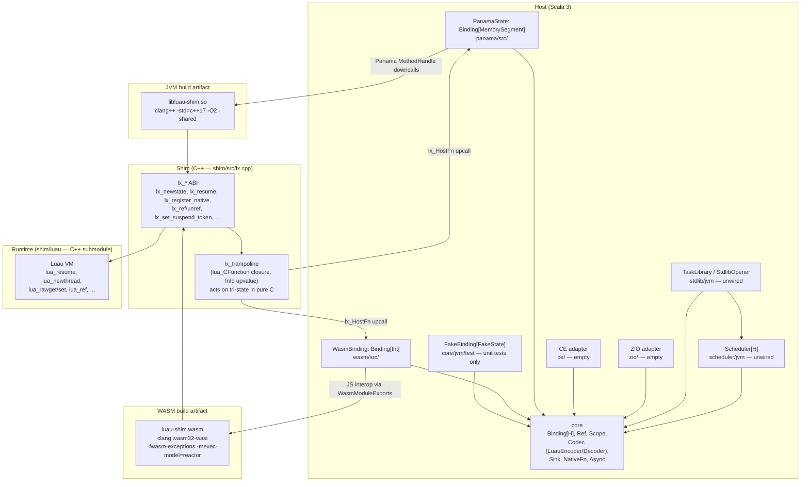

# luau-scala: Top-Level Architecture Overview

_Date: 2026-06-10_

---

## 1. Purpose and Scope

luau-scala embeds the upstream Roblox Luau C++ Runtime into Scala 3. The Host — the Scala side — never calls `lua_pcall` or `lua_call` directly; all Luau execution enters exclusively through the Resume boundary (`lx_resume`), which converts every error into a status code and guarantees no `longjmp` ever crosses a Panama downcall or a WASM host frame. The project targets two platforms from a single Scala codebase: the JVM via `java.lang.foreign` (Panama FFM), and JavaScript via Luau compiled to WASM (Scala.js).

---

## 2. Module Table

The table below reflects what `build.mill` actually declares. Modules marked **unwired** have complete source files on disk but are not registered in `build.mill` and are therefore invisible to Mill — they receive no compilation, no tests, and no CI coverage.

| Module | Mill path | Platform | Source directory | Status |
|--------|-----------|----------|-----------------|--------|
| Core (JVM) | `core.jvm` | JVM | `core/jvm/src/` | Active |
| Core (JS) | `core.js` | ScalaJS | `core/js/src` → symlink to `../jvm/src` | Active |
| Panama backend | `panama` | JVM | `panama/src/` | Active |
| WASM backend | `wasm` | ScalaJS | `wasm/src/` | Active |
| Shim build | `shim` | C++ / shell | `shim/src/`, `shim/include/` | Active |
| Scheduler | _(none)_ | JVM only | `scheduler/jvm/src/` | **Unwired** |
| Standard library / Task | _(none)_ | JVM only | `stdlib/jvm/src/` | **Unwired** |
| ZIO adapter | _(none)_ | — | `zio/src/luau/zio/` | **Unwired, empty** |
| CE adapter | _(none)_ | — | `ce/jvm/src/luau/ce/` | **Unwired, empty** |

Scala version: **3.8.3**. ScalaJS version: **1.21.0**. munit **1.2.0** is the test framework for all active modules.

The `core.js` source sharing deserves a note: `core/js/src` is a filesystem symlink pointing to `../jvm/src` (`lrwxrwxrwx core/js/src -> ../jvm/src`, verified by `ls -la`). Scala.js compiles the exact same `.scala` files as core.jvm, making all `luau.core.*` types available on the JS platform. This works today because no `core/jvm/src` file imports a JVM-only API in its public surface — though `Sink.scala:18` does call `java.nio.charset.StandardCharsets` inside `pushString`'s default implementation, which would fail if `core.js` were compiled independently of the scaffolding currently keeping that path off the Scala.js code path.

---

## 3. Component Diagram



---

## 4. The Shim: C ABI and Trampoline

The Shim (`shim/src/lx.cpp`) is the sole C++ artifact compiled against the Luau C API (`lua.h`, `lualib.h`, `luacode.h`). Its public interface is the narrow `lx_*` ABI declared in `shim/include/lx.h`. Key design guarantees:

- **`lx_resume` is the only execution entry point** (`lx.h:135`). All Luau code executes inside a `lua_resume` call; errors return as status codes (`LX_RESUME_OK=0`, `LX_RESUME_YIELD=1`, `LX_RESUME_ERR=2`, `LX_RESUME_MEMERR=3`), never as exceptions or `longjmp`s crossing the FFI boundary.

- **The trampoline** (`lx_trampoline` in `lx.cpp:42`) is a `lua_CFunction` installed by `lx_register_native` as a closure with a single integer upvalue (`fnId`). When Luau scripts invoke a Native function, the trampoline reads `fnId`, calls the `lx_HostFn` upcall pointer registered at state creation, and acts on the tri-state result entirely in pure C:
  - `LX_RETURN` → return `nResults` to Lua machinery.
  - `LX_FAIL` → call `lua_error(L)` in C (safe inside `lua_resume`'s `setjmp`).
  - `LX_SUSPEND` → call `lua_yield(L, 0)` in C, with `lx_trampoline_k` as the continuation.

- **Per-state metadata** (`LxStateData` in `lx.cpp:15`) is stored via `lua_setthreaddata` / `lua_getthreaddata` on the main thread. It holds the `lx_HostFn` upcall pointer and a 64-bit `suspendToken` used to pass Async primitive context from the Shim trampoline back to the Host after a Suspension.

- **Suspend tokens** (`lx_set_suspend_token` / `lx_get_suspend_token`, `lx.h:325,333`): before returning `LX_SUSPEND`, the Host stores a 64-bit opaque token in `LxStateData`. The Host reads it after `lx_resume` returns `LX_RESUME_YIELD` to discover which async operation to wire. The token is per-Isolate, valid only between the return of one `lx_resume` and the start of the next.

- **GC and library helpers**: `lx_openlibs(state, mask)` opens standard libraries selected by bitmask (`LX_LIB_BASE`, `LX_LIB_MATH`, etc.); `lx_sandbox(state)` nulls out unsafe globals and freezes the global table via `luaL_sandbox`. Both are called by `StdlibOpener.open` in the (currently unwired) stdlib module.

---

## 5. Core Module: The Binding[H] Contract

`core/jvm/src/luau/core/Binding.scala` defines the platform-agnostic contract as a Scala 3 trait parameterized over a handle type `H`:

```scala
trait Binding[H]:
  def newState(): H
  def closeState(state: H): Unit
  def compileAndLoad(state: H, source: IArray[Byte], chunkname: String): Either[LuaError, Unit]
  def resume(thread: H, nargs: Int): ResumeResult
  def newThread(state: H): H
  def pushNil(state: H): Unit
  // … all push/read/table/ref ops …
  def ref(state: H): Ref[H]
  def unref(state: H, key: Int): Unit
  def registerNativeFn(state: H, fn: NativeFn[H]): Unit
  def getGlobal(state: H, name: String): Unit
  def setGlobal(state: H, name: String): Unit
  def openScope(state: H): Scope[H] = Scope(this, state)
  def openLibs(state: H, mask: Int): Unit
  def sandbox(state: H): Unit
```

`H` is `MemorySegment` in the Panama backend, `Int` (a WASM linear-memory pointer) in the WASM backend, and `FakeState` in the fake in-memory backend used by unit tests.

### Key supporting types in `core`

| Type | File | Purpose |
|------|------|---------|
| `Ref[H]` | `core/jvm/src/luau/core/Ref.scala` | `AutoCloseable` Host-held registry handle. `push()` restores value to the stack; `close()` calls `binding.unref` idempotently via `@volatile var closed`. Constructor is `private[core]`; only `Binding.ref()` creates Refs. |
| `Scope[H]` | `core/jvm/src/luau/core/Scope.scala` | LIFO Ref-owning region. `captureTop()` calls `binding.ref` and tracks the result; `close()` unrefs all in reverse-insertion order. |
| `LuaValue` | `core/jvm/src/luau/core/LuaValue.scala` | Sealed ADT crossing the Resume boundary: `Nil`, `Bool` (True/False), `Number(Double)`, `LuaString(IArray[Byte])`, `LuaRef(Ref[?])`. |
| `LuaType` | `core/jvm/src/luau/core/LuaType.scala` | Enum with `luaCode: Int`. **Note**: codes stored here (`String=4, Table=5, Function=6`) do not match the actual Luau `lua_Type` enum (`LX_TSTRING=6, LX_TTABLE=7, LX_TFUNCTION=8` per `lx.h:193-195`). `PanamaState.typeAt` avoids this by matching against `LxConstants` directly; `WasmBinding.typeAt` uses an explicit integer match (`wasm/src/luau/wasm/WasmBinding.scala:107-120`) that maps correctly against actual Luau codes. |
| `LuaError` | `core/jvm/src/luau/core/LuaError.scala` | `Throwable` with `writableStackTrace=false`; carries `message` and `Level` (Runtime/Memory/Handler). Control-flow, not diagnostic. |
| `NativeFnResult` | `core/jvm/src/luau/core/NativeFnResult.scala` | `Return(nResults: Int)` / `Fail(value: LuaValue)` / `Suspend(register: Resume => Cancel)`. |
| `ResumeResult` | `core/jvm/src/luau/core/ResumeResult.scala` | `Returned(nresults)` / `Yielded(nresults)` / `Error(LuaError)`. |
| `Resume` / `Cancel` | `core/jvm/src/luau/core/Async.scala` | Opaque types powering the Async primitive. `Resume = Either[LuaError, LuaValue] => Unit` (one-shot, enqueue-only); `Cancel = () => Unit`. |

### Codec

`LuauEncoder[A]` and `LuauDecoder[A]` (`core/jvm/src/luau/core/codec/`) are the typeclass pair enforcing copy-only data transfer (ADR-0006). Encoders write through a `Sink[H]` (`core/jvm/src/luau/core/codec/Sink.scala`) — a streaming push target whose `pushNil` / `pushBoolean` / `pushNumber` / `pushBytes` / `beginTable` / `endTable` / `pushKey` / `pushValue` / `pushArrayValue` / `pushField` methods are abstract. This keeps encoder logic platform-agnostic while the backend-specific `SinkImpl[H]` (JVM) and `WasmSink` (WASM) implement the actual stack operations. Both derive from the same encoder invocation path without a copy to an intermediate tree.

---

## 6. Panama Backend (JVM)

The Panama backend implements `Binding[MemorySegment]` where `H` is a `MemorySegment` holding a `lua_State*` (or `lua_Thread*`). The separation is: `PanamaState.L` is the root Isolate (`lx_State`); the `H` passed to most `Binding` methods is the active coroutine thread (`lx_Thread`).

**`PanamaState`** (`panama/src/luau/panama/PanamaState.scala`):
- Wraps every lx_* downcall via `MethodHandle` resolved from `LxHandles` (`panama/src/luau/panama/LxHandles.scala`), which eagerly resolves all symbols from `libluau-shim` at class load.
- `PanamaState.open()` allocates a shared `Arena` for the upcall stub lifetime, allocates the upcall stub via `NativeFnDispatcher.allocateUpcallStub`, calls `lx_newstate` with that stub, and initializes the dispatcher.
- `PanamaState.ref(state)` does **not** pop the value after `lx_ref` — consistent with `lx.h:286` which states "the value remains on the stack."

**`NativeFnDispatcher`** (`panama/src/luau/panama/NativeFnDispatcher.scala`):
- Installs one shared Panama upcall stub matching `lx_HostFn` (`FunctionDescriptor.of(JAVA_INT, ADDRESS, ADDRESS, JAVA_INT, JAVA_INT, ADDRESS)`).
- Routes calls to registered `NativeFn[MemorySegment]` by `fnId` via `ConcurrentHashMap`.
- On `NativeFnResult.Suspend`: allocates a token in `SuspendRegistry`, stores it via `lx_set_suspend_token`.

**`SuspendRegistry`** (`panama/src/luau/panama/SuspendRegistry.scala`): thread-safe store of pending `NativeFnResult.Suspend` values, keyed by monotonic `Long` token. `allocToken` assigns and stores; `consume` removes and returns.

**`getGlobal` / `setGlobal`**: Because `lx_set_global` / `lx_get_global` MethodHandles are not declared in `LxHandles`, `PanamaState` implements these using `LUA_GLOBALSINDEX = -10002` with `lx_rawget` / `lx_rawset` workarounds (`PanamaState.scala:205-215`).

---

## 7. WASM Backend (Scala.js)

The WASM backend implements `Binding[Int]` where `H = Int` is a 32-bit WASM linear-memory pointer to `lua_State`. Because the Luau C API uses a two-handle convention (state + thread), `WasmBinding` calls `mainThread(state)` (`wasm/src/luau/wasm/WasmBinding.scala:249`) before most Shim operations.

**Data flow** (Host → WASM linear memory):
1. `WasmMarshal` (`wasm/src/luau/wasm/WasmMarshal.scala`) `malloc`s a buffer, copies bytes into `HEAPU8` (the linear-memory view), invokes the Shim export, then `free`s.
2. `HEAPU8` and `HEAP32` are defined as fresh-view JS property getters on every access — mandatory because WASM memory growth detaches the backing `ArrayBuffer` (`LuauShimFactory.scala:76-83`).
3. Out-parameter integers (`nResults`, string lengths) are read via `allocOutInt()` which `malloc`s 4 bytes and returns a little-endian reader closure.

**`Trampoline`** (`wasm/src/luau/wasm/Trampoline.scala`):
- A global singleton managing the JS-side upcall function pointer and the `fnId → NativeFn` dispatch table.
- `install()` grows the WASM indirect function table by one slot via `addFunction(upcall, "iiiiii")` and stores the resulting `fnPtr`. The JS upcall is typed `js.Function5[Int, Int, Int, Int, Int, Int]` matching the `lx_HostFn` signature.
- `reset()` clears `fnPtr`, `table`, `pendingSuspend`, and resets `nextId`. Called by `WasmBackend.load()` before `install()` on every new WASM instance to clear stale state.
- `pendingSuspend` holds `Option[Resume => Cancel]` between `dispatch()` detecting a `Suspend` result and the `WasmBinding` layer consuming it via `consumePendingSuspend()`.

**`WasmBackend`** (`wasm/src/luau/wasm/WasmBackend.scala`):
- `load()` calls `LuauShimFactory`, sets `WasmModule`, then calls `Trampoline.reset(); Trampoline.install()`.
- `createBinding()` returns `WasmBinding.create()`.

**`LuauShimFactory`** (`wasm/src/luau/wasm/LuauShimFactory.scala`):
- Loads the raw WASM binary from `LUAU_WASM_PATH` (env var set by `wasm.jsEnvConfig` in `build.mill:58`).
- Uses `WebAssembly.Module` + `WebAssembly.Instance` directly (not Emscripten's JS wrapper).
- Provides typed WASI `snapshot_preview1` stubs (all no-ops).
- Calls `ex._initialize()` for the reactor model — running C++ static constructors exactly once.
- `addFunction` grows the indirect table with `tbl.grow(1)`, wraps the JS function via a minimal inline WASM module (`cachedWrapMod`), and sets the new slot.

**`WasmBinding.ref(state)`** (`WasmBinding.scala:205-211`): calls `_lx_ref(state, thread, -1)` then explicitly pops one value with `_lx_pop`. This differs from `PanamaState.ref` which does not pop — the behavioral difference stems from a design choice made in the WASM backend to match `luaL_ref` semantics.

---

## 8. Data Flow: Host ↔ Shim ↔ Runtime

The following illustrates a complete Native function roundtrip:

```
Script calls registered function
    │
    ▼
Luau VM executes lua_CFunction (lx_trampoline)
    │   reads fnId from upvalue
    │   calls lx_HostFn(state, thread, fnId, nArgs, &nResults)
    ▼
[Panama] NativeFnDispatcher.dispatch  OR  [WASM] Trampoline.dispatch
    │   looks up NativeFn[H] by fnId
    │   calls fn(thread, nArgs)  → NativeFnResult
    ▼
NativeFnResult:
  Return(n)    → set *nResults=n; trampoline returns n to Luau
  Fail(value)  → trampoline calls lua_error(L) in pure C
  Suspend(reg) → Host stores token via lx_set_suspend_token
                 trampoline calls lua_yield(L, 0) in pure C
                 lx_resume returns LX_RESUME_YIELD
                 Host reads token, calls reg(resumeCallback)
                 async op fires resumeCallback later (enqueue-only)
```

**Codec crossing** (Host → Luau, copy):
```
Scala value A (with LuauEncoder[A])
    │  encode[H](value, sink)
    ▼
Sink[H] pushNil/pushBoolean/pushNumber/pushBytes/beginTable…
    │  each push op calls Binding[H] (→ lx_push_* in Shim)
    ▼
Luau stack / heap — owns its copy
```

**Codec crossing** (Luau → Host, decode):
```
Stack index idx
    │  LuauDecoder[A].decode(binding, state, idx)
    ▼
Non-raising reads (typeAt, toNumber, toBoolean, toBytes, rawGet)
    ▼
Either[LuaError, A] — Host owns the decoded value
```

---

## 9. Build Pipeline

### JVM native library

`build.mill` defines `shim.nativeBuild` (line 110):

```
clang++ -std=c++17 -O2 -shared -fPIC
  -I shim/include -I shim/luau/VM/include -I shim/luau/Common/include
  -I shim/luau/Compiler/include -I shim/luau/Ast/include -I shim/luau/Bytecode/include
  -o libluau-shim.so
  shim/src/lx.cpp
  shim/luau/VM/src/*.cpp shim/luau/Compiler/src/*.cpp shim/luau/Ast/src/*.cpp …
```

Panama loads the result via `System.getProperty("luau.shim.lib")` or `System.loadLibrary("luau-shim")` at `LxHandles` class-load time (`LxHandles.scala:9-11`).

### WASM binary

Two build paths exist:

| Path | Mill task | Status |
|------|-----------|--------|
| Emscripten (`emcc`) | `shim.wasmBuild` (`build.mill:126`) | Vestigial. Produces `MODULARIZE=1` JS wrapper incompatible with `LuauShimFactory`, which uses raw `WebAssembly.Instance`. |
| Native clang/WASI | `shim.wasmBuildNative` (`build.mill:168`) | Active. Delegates to `shim/build-wasm.sh`. |

`shim/build-wasm.sh` compiles and links with:
- `--target=wasm32-wasi`
- `-fwasm-exceptions -mllvm -wasm-use-legacy-eh=false` — native C++ exceptions via new EH proposal.
- `-mexec-model=reactor` — no `_start`; C++ static constructors run via `_initialize()`.
- `--growable-table --export-table` — indirect function table growable at runtime (required for `Trampoline.install()`).
- `shim/src/cpp_exception_tag.s` assembled and linked — defines the `__cpp_exception` WASM tag, which wasm-ld 22 does not synthesize automatically.
- All `lx_*` symbols individually exported via `-Wl,--export=lx_*`.

`wasm.jsEnvConfig` (`build.mill:55-59`) depends on `shim.wasmBuildNative` and passes `LUAU_WASM_PATH` to the Node.js test environment. `wasmBuildNative` uses `sys.env("PWD")` (`build.mill:169`) to find the project root — brittle if Mill is invoked from a subdirectory where `PWD` differs from `os.pwd`.

### Luau submodule tracking

`shim.luauSubmoduleHead` (`build.mill:81`) is a `Task.Input` that reads `shim/luau/.git/HEAD`. Any task depending on Luau sources re-runs when the submodule is updated.

---

## 10. Test Topology

| Suite | Location | Backend | Scope |
|-------|----------|---------|-------|
| `CodecSpec` | `core/jvm/test/src/luau/core/codec/` | `FakeBinding` | Codec round-trips: encode/decode for all primitive types, String, bytes, Option, Seq, Map, case class |
| `NativeFnResultSpec` | `core/jvm/test/src/luau/core/` | `FakeBinding` | `NativeFnResult` variants; `Resume`/`Cancel` opaque extension methods |
| `RefScopeSpec` | `core/jvm/test/src/luau/core/` | `FakeBinding` | `Ref` lifecycle (idempotent close, push, leak); `Scope` LIFO close |
| `CompileAndRunTest`, `NativeFunctionTest`, `NativeLibSmokeTest`, `RefLifecycleTest`, `StringMarshalTest`, `SuspendResumeTest` | `panama/test/src/luau/panama/` | `PanamaState` | JVM integration: compile+execute, Native functions, string marshal, Suspend/Resume |
| `SharedBackendSuite` (abstract, 10 TCs) | `wasm/test/src/luau/core/` | `Binding[Int]` | TC-SHARED-01 through TC-SHARED-10: basic execution, string push/read, table rawseti/rawgeti, Native function call, Native Fail+pcall, Ref lifecycle, Scope lifecycle, coroutine.yield, UTF-8, compile error |
| `WasmBackendSuite` | `wasm/test/src/luau/wasm/` | `WasmBinding` | Concrete `SharedBackendSuite`; reloads WASM per test via `WasmBackend.load()` for isolation |
| `WasmModuleSmokeTest` | `wasm/test/src/luau/wasm/` | `WasmBinding` | `_lx_newstate` returns non-zero handle |
| `WasmSpecificSuite` | `wasm/test/src/luau/wasm/` | `WasmBinding` | TC-WASM-01 module loads; TC-WASM-02 malloc/free/HEAPU8 roundtrip; TC-WASM-03 addFunction/dynCall_iiiiii; TC-WASM-04 two independent WasmBinding states |

`SharedBackendSuite` lives in `package luau.core` (not `luau.wasm`) and is typed `Binding[Int]`, which currently limits reuse to WASM-typed backends. A future Panama suite extending it would need a common `Binding[?]` parameterization.

**Current status**: WASM / JS-side tests pass. JVM Panama tests are partially complete — `SuspendResumeTest` exercises the Async primitive path. The Scheduler and stdlib modules have no test coverage because they are not wired into `build.mill`.

---

## 11. Unwired Modules: Status on Disk

### Scheduler (`scheduler/jvm/src/luau/scheduler/`)

A complete, compilable JVM-only Scheduler implementation exists on disk. Key files:

- `Scheduler.scala` — `final class Scheduler[H]` managing a `PlatformQueue[ReadyTask[H]]`, `liveTasks: mutable.HashMap[Long, Task[H]]`, and a `java.util.Timer` for delayed tasks. `runAllReady()` is the Driver loop: dequeue, `binding.resume`, handle `ResumeResult`. `Suspend` results are wired via `wireSuspend`, which installs the one-shot `Resume` callback as a `runQueue.enqueue`-only operation.
- `Task.scala`, `TaskState.scala`, `ReadyTask.scala`, `TaskHandle.scala` — Task data model.
- `PlatformQueue.scala` — wraps `java.util.concurrent.ConcurrentLinkedQueue` for thread-safe enqueue from completion callbacks, drain on the Driver thread.
- `ErrorPolicy.scala` — `logAndDiscard` default; pluggable per-state error handler.

The Scheduler depends on `java.util.concurrent.atomic.AtomicLong`, `java.util.Timer`, and `ConcurrentLinkedQueue` — all JVM-only. A JS-compatible Scheduler would require platform abstraction, which `scheduler/jvm/` does not provide.

### Standard Library (`stdlib/jvm/src/luau/stdlib/`)

- `StdlibOpener.scala` — `open[H](binding, state, scheduler, mask)` calls `binding.openLibs(state, mask)`, `TaskLibrary.install(...)`, then `binding.sandbox(state)`.
- `TaskLibrary.scala` — installs the Roblox-style `task.*` API (`task.spawn`, `task.defer`, `task.delay`, `task.wait`, `task.cancel`) as Native functions via `binding.registerNativeFn`. `task.wait` returns `NativeFnResult.Suspend` wired against the Scheduler's timer.

### Effect Adapters (`zio/`, `ce/`)

Both directories exist but contain **zero Scala source files**. The ZIO and cats-effect adapters are completely unimplemented. Their dependency versions are pinned in `build.mill` (`zioVersion = "2.1.25"`, `catsEffectVersion = "3.5.0"`) but no modules are declared using them.

---

## 12. CI and Known Issues

The CI workflow (`.github/workflows/ci.yml`) runs on `ubuntu-22.04` and installs Java 21 (Temurin), Node 20, clang-17, and emsdk 3.1.50. It downloads Mill **0.12.3**, which is a different major version from the local `.mill-version` pin of **1.1.6** — a known discrepancy with potential build-semantics differences.

The most critical CI defect is at step "Copy WASM to test resources" (`ci.yml:46`):

```yaml
run: ./mill shim.copyWasmToResources
```

This Mill task **does not exist** in `build.mill`. The shell script `shim/copy-wasm-test-resources.sh` exists on disk but is not exposed as a Mill task. This step will always fail, blocking downstream Panama and WASM test runs in CI.

The `shim.wasmBuild` (Emscripten) task produces a `MODULARIZE=1` JS artifact that `LuauShimFactory` cannot consume — `LuauShimFactory` instantiates raw `WebAssembly.Instance` without Emscripten's module wrapper. The Emscripten path is vestigial dead code; the active WASM build is `shim.wasmBuildNative` (delegating to `shim/build-wasm.sh`).

The `out/` build cache directory is **not** in `.gitignore`, causing dozens of modified tracked files after every Mill build. This is a quality-of-life issue: `git status` is permanently noisy.

---

## 13. Key Invariants

The following invariants are enforced across the codebase (each has a corresponding ADR):

1. **Resume boundary** (ADR-0001): `lx_resume` is the only function that executes Luau code. `lua_pcall`, `lua_call`, and `lua_error` are never called from the Binding backends; only from inside the Shim trampoline running within `lua_resume`'s `setjmp` frame.

2. **Scala NativeFns cannot raise** (ADR-0001, ADR-0007): they return `NativeFnResult`. The Shim trampoline calls `lua_error` in C after the upcall returns, keeping the JVM/JS frame fully off the native stack before any `longjmp` fires.

3. **Stackless Task** (ADR-0003): the native C stack is fully unwound when a Task yields. Parked Tasks are pure heap data. No native stack reference may be stored across a `Suspend`.

4. **Resume is enqueue-only** (ADR-0002, ADR-0004): the `Resume` callback passed to `Suspend(register)` must only enqueue a `ReadyTask` onto the Run queue — never resume inline. Calling `lua_resume` from a completion callback is a concurrency violation.

5. **Resume is one-shot** (ADR-0007): the `@volatile var fired` flag in `Scheduler.wireSuspend` guards against double-resume.

6. **Ref deterministic lifetime** (ADR-0005): `Ref.close()` is the only release mechanism (`Ref.scala:16-19`). No GC finalizer backstop. `close()` after state teardown must be a no-op — `PanamaState.unref` checks `!closed` before calling `lx_unref`.

7. **Copy-only data boundary** (ADR-0006): only types with a `LuauEncoder[A]` instance may cross Host→Luau. The compiler enforces this. `LuaRef` cannot be used as a table key — `WasmSink.pushKey` and `SinkImpl.pushKey` throw at runtime if a `LuaRef` is passed as a key.

8. **WASM reactor invariant**: `_initialize()` called exactly once per WASM instance (`LuauShimFactory.scala:67`). `Trampoline.reset()` called before `install()` on each new instance (`WasmBackend.scala:13-14`).

9. **HEAPU8/HEAP32 fresh views**: both accessed as property getters returning `new Uint8Array(mem.buffer)` / `new Int32Array(mem.buffer)` on every call, because memory growth detaches the backing `ArrayBuffer` (`LuauShimFactory.scala:76-83`).
