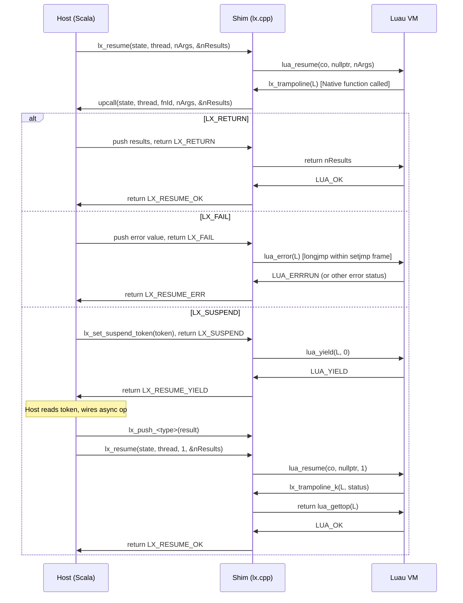

# Shim ABI Reference

**Date:** 2026-06-10  
**Status:** Normative  
**Sources verified against:** `shim/include/lx.h`, `shim/src/lx.cpp`, `shim/src/cpp_exception_tag.s`, `shim/build-wasm.sh`, `shim/build-eh-sysroot.sh`, `shim/src/lx_test.c`, `wasm/src/luau/wasm/WasmModule.scala`, `wasm/src/luau/wasm/WasmBinding.scala`, `panama/src/luau/panama/LxHandles.scala`

---

## 1. Overview

The Shim is the slim C++ layer (`shim/src/lx.cpp`, public header `shim/include/lx.h`) that wraps the upstream Luau C API and exposes a narrow, task-shaped ABI. Both binding backends — the Panama backend (JVM, `java.lang.foreign`) and the WASM backend (JS, Scala.js interop) — call this ABI. It is compiled from a single source tree to a native shared library for the JVM and to `luau-shim.wasm` for the WASM backend.

The ABI surface is entirely `extern "C"`. All public symbols are declared in `lx.h` with the exception of two bootstrap helpers (`lx_set_global`, `lx_get_global`) that are defined in `lx.cpp` and exported from the WASM binary but omitted from `lx.h`.

### 1.1 Design Constraints

Three invariants govern every design decision in the Shim:

1. **No longjmp across the FFI boundary.** `lx_resume` is the sole execution entry point. All Luau errors and yields are converted to integer status codes before returning to the Host. The Luau VM's `longjmp`-based error mechanism never unwinds past the boundary.

2. **No `lua_pcall` anywhere in the Shim.** Errors from Native functions are raised in pure C inside `lua_resume`'s `setjmp` frame via `lua_error`. The trampoline calls `lua_error(L)` in the `LX_FAIL` branch (`lx.cpp:67`), which longjmps safely within the frame that `lua_resume` already established.

3. **WASM: uniform C++ exception encoding.** The WASM build requires native C++ exceptions (Luau's internal error model uses `throw`). Every translation unit is compiled with `-fwasm-exceptions -mllvm -wasm-use-legacy-eh=false` (new-EH proposal, not legacy SjLj). Mixing encodings across object files in a single link breaks unwinding. See Section 7 for full details.

---

## 2. Core Types

### 2.1 Opaque Handles

```c
typedef void* lx_State;   /* One Isolate's main lua_State* */
typedef void* lx_Thread;  /* Any lua_State* in that Isolate */
```
`lx_State` is always the Isolate's main thread. `lx_Thread` may be the main thread or any coroutine thread created with `lx_new_thread`. Both are `void*` to avoid exposing Luau internals across the ABI. (`lx.h:16–19`)

### 2.2 Per-Isolate Metadata: `LxStateData`

```cpp
struct LxStateData {
    lx_HostFn  upcall;
    int64_t    suspendToken;
};
```
One instance is heap-allocated at `lx_newstate` and stored in the main thread's thread-data slot via `lua_setthreaddata`. It is accessible from any coroutine in the same Isolate through `get_state_data`, which resolves via `lua_getthreaddata(lua_mainthread(L))`. (`lx.cpp:15–22`)

### 2.3 Type Tag Constants

| Constant | Value | Luau type |
|---|---|---|
| `LX_TNONE` | -1 | no value / invalid index |
| `LX_TNIL` | 0 | `nil` |
| `LX_TBOOLEAN` | 1 | `boolean` |
| `LX_TNUMBER` | 3 | `number` (float) |
| `LX_TINTEGER` | 4 | `number` (integer, Luau extension) |
| `LX_TVECTOR` | 5 | `vector` (Luau extension) |
| `LX_TSTRING` | 6 | `string` |
| `LX_TTABLE` | 7 | `table` |
| `LX_TFUNCTION` | 8 | `function` |
| `LX_TUSERDATA` | 9 | `userdata` |
| `LX_TTHREAD` | 10 | `thread` |
| `LX_TBUFFER` | 11 | `buffer` (Luau extension) |

Note that type codes 2 is not assigned (skipped between `LX_TBOOLEAN` and `LX_TNUMBER`), matching Luau's internal `lua_Type` enum. (`lx.h:187–198`)

---

## 3. Native Function Trampoline Contract (ADR-0007)

### 3.1 `lx_HostFn` — Tri-State Upcall

```c
typedef int (*lx_HostFn)(
    lx_State  state,
    lx_Thread thread,
    int32_t   fnId,
    int       nArgs,
    int*      nResults
);
```

The Host registers exactly one `lx_HostFn` per Isolate at `lx_newstate`. Every Native function installed in that Isolate calls through this single function pointer, distinguished by `fnId`. (`lx.h:47–53`)

**Return codes:**

| Constant | Value | Meaning |
|---|---|---|
| `LX_RETURN` | 0 | Native function succeeded; Host pushed `nResults` values above the arguments. |
| `LX_FAIL` | 1 | Native function failed; Host pushed one error value at the stack top. |
| `LX_SUSPEND` | 2 | Native function suspends; Host called `lx_set_suspend_token` before returning. |

(`lx.h:26–28`)

**Host obligations per return code:**

- `LX_RETURN`: Push exactly `*nResults` values onto `thread`'s stack. The trampoline returns `nResults` to Luau so the call site receives exactly those values.
- `LX_FAIL`: Push exactly one error value. The trampoline calls `lua_error(L)`, which longjmps within `lua_resume`'s `setjmp` frame. The error propagates to the nearest Luau `pcall` or to `lx_resume`'s return.
- `LX_SUSPEND`: Call `lx_set_suspend_token` before returning. The trampoline calls `lua_yield(L, 0)`. When the coroutine is next resumed, the Luau continuation `lx_trampoline_k` fires and returns all resume arguments as the return value of the suspended Native function call.

### 3.2 `lx_trampoline` — Main Dispatch Body

```cpp
static int lx_trampoline(lua_State* L) {
    int fnId = (int)lua_tointeger(L, lua_upvalueindex(1));
    LxStateData* d = get_state_data(L);
    int nArgs = lua_gettop(L);
    lua_State* main = lua_mainthread(L);

    int nResults = 0;
    int outcome = d->upcall(
        static_cast<lx_State>(main),
        static_cast<lx_Thread>(L),
        (int32_t)fnId, nArgs, &nResults
    );

    switch (outcome) {
        case LX_RETURN:  return nResults;
        case LX_FAIL:    lua_error(L); return 0;
        case LX_SUSPEND: return lua_yield(L, 0);
        default:
            lua_pushliteral(L, "lx: unknown upcall outcome");
            lua_error(L); return 0;
    }
}
```
(`lx.cpp:42–81`)

The trampoline is a `lua_CFunction`. It runs only inside `lua_resume`'s `setjmp` frame, so calling `lua_error` (which longjmps) is safe. It reads `fnId` from its sole upvalue (an integer stored at `lua_upvalueindex(1)`), then calls the registered `lx_HostFn`. It never wraps the upcall in `lua_pcall`.

### 3.3 `lx_trampoline_k` — Suspension Continuation

```cpp
static int lx_trampoline_k(lua_State* L, int /*status*/) {
    return lua_gettop(L);
}
```
(`lx.cpp:33–35`)

When `lx_trampoline` returns `LX_SUSPEND`, it calls `lua_yield(L, 0)`. The continuation `lx_trampoline_k` is registered via `lua_pushcclosurek` (see `lx_register_native`, Section 6.1). When the coroutine is subsequently resumed with `nArgs` arguments, Luau calls `lx_trampoline_k`, which returns `lua_gettop(L)` — the number of values currently on the stack. Those values become the return values of the suspended Native function call from Luau's perspective.

**Important:** after a resume, `lua_gettop(L)` equals the number of arguments passed to `lua_resume`. The continuation does not see any arguments that preceded the yield on the stack, because `lua_yield(L, 0)` yielded zero values and the resume starts fresh. The continuation's `return lua_gettop(L)` therefore returns exactly the resume argument count.

### 3.4 Trampoline Invariants

- The trampoline runs only inside `lua_resume`'s `setjmp` frame. Calling `lua_error` from within it is always safe.
- The upcall receives `nArgs = lua_gettop(L)` at the time of the call, which includes all arguments Luau placed on the coroutine's stack for the function call.
- On `LX_RETURN`, the Host must push new values above the existing argument slots. Luau's call machinery takes the top `nResults` values as results.
- On `LX_SUSPEND`, the Host must call `lx_set_suspend_token` before returning `LX_SUSPEND` to the trampoline. The token is read by the Host after `lx_resume` returns `LX_RESUME_YIELD`.

---

## 4. Resume Boundary

### 4.1 Resume Result Codes

| Constant | Value | Meaning |
|---|---|---|
| `LX_RESUME_OK` | 0 | Thread returned normally; `*nResults` set. |
| `LX_RESUME_YIELD` | 1 | Thread yielded (including Native function suspension); `*nResults` set. |
| `LX_RESUME_ERR` | 2 | Runtime error; error value on stack at index -1. |
| `LX_RESUME_MEMERR` | 3 | Memory allocation error. |

(`lx.h:130–133`)

### 4.2 `lx_resume`

```c
int lx_resume(
    lx_State  state,
    lx_Thread thread,
    int       nArgs,
    int*      nResults
);
```

**Implementation** (`lx.cpp:177–198`):

```cpp
int lx_resume(lx_State state, lx_Thread thread, int nArgs, int* nResults) {
    lua_State* co = static_cast<lua_State*>(thread);
    int status = lua_resume(co, nullptr, nArgs);
    switch (status) {
        case LUA_OK:    *nResults = lua_gettop(co); return LX_RESUME_OK;
        case LUA_YIELD: *nResults = lua_gettop(co); return LX_RESUME_YIELD;
        case LUA_ERRMEM: *nResults = 0;             return LX_RESUME_MEMERR;
        default:         *nResults = 0;             return LX_RESUME_ERR;
    }
}
```

The `lx_State state` parameter is not used inside the function body (`(void)L` after the cast). It is present to match the general parameter style and enable future per-state logic.

**Stack effect:** `nArgs` values are consumed from the top of `thread`'s stack (passed as resume arguments). On `LX_RESUME_OK` or `LX_RESUME_YIELD`, `*nResults` values are left on `thread`'s stack. On `LX_RESUME_ERR`, one error value is left on `thread`'s stack (readable via `lx_copy_error`). On `LX_RESUME_MEMERR`, the stack state is indeterminate.

**Error behavior:** Never errors itself. All Luau errors are captured by `lua_resume`'s internal `setjmp` and converted to a non-zero `status`. No longjmp escapes.

### 4.3 Resume Boundary Invariant

`lx_resume` is the **only** function in the Shim that executes Luau code. No `lua_pcall`, `lua_call`, or `lua_resume` call exists anywhere else in `lx.cpp`. This is the normative Resume boundary (`CONTEXT.md`).

---

## 5. Suspend Token Mechanism

The suspend token is a 64-bit opaque value the Host uses to identify which pending async operation corresponds to a given Suspension.

```c
void    lx_set_suspend_token(lx_State state, lx_Thread thread, int64_t token);
int64_t lx_get_suspend_token(lx_State state, lx_Thread thread);
```
(`lx.h:325–333`, `lx.cpp:318–326`)

**Storage:** The token is stored in `LxStateData.suspendToken` (`lx.cpp:17`). Both functions resolve the `LxStateData` via `get_state_data(static_cast<lua_State*>(thread))`, which calls `lua_getthreaddata(lua_mainthread(thread))`. The result is **per-Isolate**, not per-coroutine. The `thread` parameter is used only to reach the main thread; the token itself is shared by all coroutines in the Isolate.

**Protocol:**

```
Host upcall (LX_SUSPEND path):
  1. Host calls lx_set_suspend_token(state, thread, token)
  2. Host returns LX_SUSPEND from the upcall
  3. Trampoline calls lua_yield(L, 0)
  4. lx_resume returns LX_RESUME_YIELD to the Host

Host after LX_RESUME_YIELD:
  5. Host calls lx_get_suspend_token(state, thread) → token
  6. Host wires the async operation identified by token
  7. When the async op completes, Host calls lx_push_<type>(result)
  8. Host calls lx_resume(state, thread, 1, &nResults)
  9. lx_trampoline_k fires, returns nResults
```

**Single-token constraint:** Only one `int64_t` field exists in `LxStateData`. If two coroutines within the same Isolate both return `LX_SUSPEND` before either is resumed, the second `lx_set_suspend_token` call overwrites the first. The architecture assumes the Scheduler drives at most one pending Suspension per Isolate at any time. Violating this constraint silently corrupts token identity.

**WASM type truncation risk:** The Scala.js extern in `wasm/src/luau/wasm/WasmModule.scala:61` declares `_lx_set_suspend_token(state: Int, thread: Int, token: Int)` — the token is `Int` (32 bits), not `Long` (64 bits). The C function signature is `int64_t`. Values above 32-bit range (or negative values with high bits set) are silently truncated at the WASM/JS boundary. The Panama backend (`panama/src/luau/panama/LxHandles.scala:85`) correctly uses `JAVA_LONG` for the token.

---

## 6. Function Reference

This section is the normative reference for every `lx_*` function. Signatures are taken from `lx.h`; implementations are in `lx.cpp`.

### 6.1 State Lifecycle

---

#### `lx_newstate`
```c
lx_State lx_newstate(lx_HostFn upcall);
```
Creates a new Luau state (one Isolate). Calls `luaL_newstate()`, heap-allocates a `LxStateData{upcall, 0}`, and stores it in the main thread's thread-data slot via `lua_setthreaddata`. Returns `NULL` on allocation failure. (`lx.cpp:87–94`)

**Stack effect:** None.  
**Error behavior:** Returns `NULL`; does not throw or longjmp.  
**Ownership:** Caller owns the returned state and must eventually call `lx_close`.

---

#### `lx_close`
```c
void lx_close(lx_State state);
```
Calls `lua_close(L)` then `delete d` on the `LxStateData`. All Refs and Threads belonging to the Isolate are invalidated. (`lx.cpp:96–101`)

**Stack effect:** N/A — state is destroyed.  
**Error behavior:** None.  
**Caution:** After `lx_close`, the `lx_State` pointer is dangling. All derived `lx_Thread` pointers are also dangling.

---

#### `lx_main_thread`
```c
lx_Thread lx_main_thread(lx_State state);
```
Returns `lua_mainthread(L)` cast to `lx_Thread`. The main thread is the coroutine created implicitly by `lx_newstate`. (`lx.cpp:103–106`)

**Stack effect:** None.  
**Error behavior:** None.

---

#### `lx_new_thread`
```c
lx_Thread lx_new_thread(lx_State state);
```
Calls `lua_newthread(L)`, which pushes the new coroutine onto `L`'s (the main thread's) stack and returns the `lua_State*`. The new coroutine is returned as `lx_Thread`. (`lx.cpp:108–113`)

**Stack effect:** Pushes one `thread` value onto the **main thread's** stack. The caller must either:
- Immediately call `lx_ref` to pin the thread object in the registry and then `lx_pop` the stack slot, or  
- `lx_pop` it later when the thread is no longer needed.

If neither is done, the thread object is held alive only by that main-thread stack slot. Neglecting to manage this slot is a subtle lifecycle bug.

**Error behavior:** Returns `NULL` on allocation failure (underlying `lua_newthread` returns `NULL`).

---

#### `lx_thread_status`
```c
int lx_thread_status(lx_State state, lx_Thread thread);
```
Wraps `lua_costatus`. Maps:

| `lua_costatus` result | Return value | Meaning |
|---|---|---|
| `LUA_CORUN` | 0 | Running |
| `LUA_COSUS` | 1 | Suspended |
| `LUA_CONOR` | 3 | Normal (caller of another coroutine) |
| `LUA_COFIN` | 2 | Dead (finished normally) |
| any other | 2 | Dead (includes `LUA_COERR`: finished with error) |

(`lx.cpp:115–127`)

**Caution:** `LUA_COFIN` (finished normally, value 3 in Luau's enum) and `LUA_COERR` (finished with error) both map to return value 2. The Host cannot distinguish them via `lx_thread_status`. Use `lx_resume`'s return code at the time the error occurred to detect error termination.

---

### 6.2 Compile and Load

#### `lx_compile_and_load`
```c
int lx_compile_and_load(
    lx_State    state,
    const char* source,
    size_t      sourceLen,
    const char* chunkname,
    int         optimizationLevel,
    int         debugLevel,
    char*       errbuf,
    size_t      errbufsz
);
```
Compiles Luau source text to bytecode via `luau_compile`, then loads the bytecode into the state via `luau_load`. (`lx.cpp:133–171`)

**Parameters:**
- `source` / `sourceLen`: Source text and byte count. Need not be NUL-terminated.
- `chunkname`: Identifies the chunk in error messages and stack traces. If `NULL`, defaults to `"?"`.
- `optimizationLevel`: `0` = no optimization, `1` = default, `2` = O2 + inlining.
- `debugLevel`: `0` = no debug info, `1` = line info, `2` = full debug.
- `errbuf` / `errbufsz`: Buffer for error messages. Written NUL-terminated.

**Return:** `0` on success; non-zero on compile or load error, with the message written to `errbuf`.

**Stack effect on success:** The compiled chunk is pushed as a `function` onto the **main thread's** (`lx_State`'s) stack, not onto any caller-supplied `lx_Thread`. If the caller wants to resume on a coroutine thread, they must move the function from the main thread to the coroutine's stack (e.g., via `lx_ref` + `lx_push_ref`).

**Stack effect on error:** No net push. The error string is written to `errbuf`.

**Buffer ownership:** `luau_compile` allocates the bytecode buffer internally and frees it before the function returns.

---

### 6.3 Resume Boundary

See Section 4 for full documentation of `lx_resume`.

---

### 6.4 Stack Push Operations

All push functions push one value onto `thread`'s stack and never error (assuming the thread is valid).

| Function | Signature | Description |
|---|---|---|
| `lx_push_nil` | `(state, thread)` | Push `nil`. |
| `lx_push_boolean` | `(state, thread, int b)` | Push `true` if `b != 0`, else `false`. |
| `lx_push_number` | `(state, thread, double n)` | Push a float. |
| `lx_push_integer` | `(state, thread, int64_t i)` | Push a Luau integer. Internally `lua_Integer` which is `int64_t` in Luau. |
| `lx_push_lstring` | `(state, thread, const char* s, size_t len)` | Push a byte string. The Shim copies the bytes immediately; the caller may free the source buffer after this call. The string is binary-safe and `len` is byte count, not NUL-terminated length. |
| `lx_push_ref` | `(state, thread, int ref)` | Push the value stored at registry ref `ref` onto `thread`'s stack. Wraps `lua_getref`. |
| `lx_push_copy` | `(state, thread, int idx)` | Duplicate the stack slot at 1-based index `idx` onto the top. Wraps `lua_pushvalue`. |

(`lx.cpp:204–212`)

---

#### `lx_pop`
```c
void lx_pop(lx_State state, lx_Thread thread, int n);
```
Pop `n` values from `thread`'s stack. Wraps `lua_pop`. No bounds checking; popping more values than exist on the stack is undefined behavior.

---

#### `lx_stack_top`
```c
int lx_stack_top(lx_State state, lx_Thread thread);
```
Return the current stack height (number of values on `thread`'s stack). Wraps `lua_gettop`.

---

### 6.5 Stack Read Operations

All read operations are **non-raising**: they never call `lua_error` and never longjmp. They use `_x` variants of Lua accessor functions that return a validity flag.

---

#### `lx_type`
```c
int lx_type(lx_State state, lx_Thread thread, int idx);
```
Return the type tag at stack index `idx`. Uses `lua_type`. Valid index: 1-based from bottom, or negative from top. Returns `LX_TNONE` (-1) for an invalid index. (`lx.cpp:218–220`)

---

#### `lx_to_number`
```c
double lx_to_number(lx_State state, lx_Thread thread, int idx, int* ok);
```
Read the float value at `idx`. Sets `*ok = 1` if the slot is a number (`LUA_TNUMBER`), `0` otherwise. Wraps `lua_tonumberx`. Does **not** coerce strings to numbers. Returns `0.0` when `*ok == 0`. (`lx.cpp:222–227`)

---

#### `lx_to_integer`
```c
int64_t lx_to_integer(lx_State state, lx_Thread thread, int idx, int* ok);
```
Read the integer value at `idx`. Sets `*ok = 1` if the slot is a Luau integer (`LUA_TINTEGER`), `0` otherwise. Wraps `lua_tointegerx`. Does **not** coerce from `LX_TNUMBER` (float). Returns `0` when `*ok == 0`. (`lx.cpp:229–234`)

---

#### `lx_to_boolean`
```c
int lx_to_boolean(lx_State state, lx_Thread thread, int idx);
```
Return `0` for `nil` or `false`; return `1` for any other value. Wraps `lua_toboolean`. Never errors. (`lx.cpp:236–238`)

---

#### `lx_to_lstring`
```c
int lx_to_lstring(lx_State state, lx_Thread thread, int idx,
                  char* dst, size_t dstlen, size_t* len);
```
Copy the string at `idx` into `dst` (up to `dstlen` bytes, NUL-terminated). Sets `*len` to the full byte length of the string (before any truncation). Returns `1` on success, `0` if the value at `idx` is not a string. (`lx.cpp:240–252`)

**Important properties:**
- Does **not** coerce other types to string. Calling on a number returns `0`.
- Does **not** mutate the stack. Uses `lua_tolstring` only after a type check, purely to read the existing string pointer.
- The Shim copies immediately; the caller does not need to keep the Lua heap alive.
- **Buffer underflow risk:** If `dstlen == 0`, the expression `dstlen - 1` wraps to `SIZE_MAX` (unsigned arithmetic), and `memcpy` copies up to `SIZE_MAX` bytes into a zero-length buffer, causing heap corruption. Callers must always pass `dstlen >= 1`.

---

#### `lx_rawlen`
```c
size_t lx_rawlen(lx_State state, lx_Thread thread, int idx);
```
Return the raw byte length of the string, table, or buffer at `idx`. Wraps `lua_objlen`. Returns `0` for wrong types. Never errors. (`lx.cpp:254–256`)

---

### 6.6 Table Operations

All table operations use raw access (no metamethods). Indices are 1-based by Luau convention.

---

#### `lx_newtable`
```c
void lx_newtable(lx_State state, lx_Thread thread, int narr, int nrec);
```
Push a new empty table with pre-allocated capacity hints: `narr` array slots, `nrec` hash slots. Wraps `lua_createtable`. (`lx.cpp:262–264`)

---

#### `lx_rawget`
```c
void lx_rawget(lx_State state, lx_Thread thread, int tidx);
```
Pop a key from `thread`'s stack top. Push the value at `table[key]` for the table at index `tidx`. Uses `lua_rawget` (no `__index` metamethod). (`lx.cpp:266–268`)

**Stack effect:** Pops 1 (key), pushes 1 (value). Net: 0.

---

#### `lx_rawset`
```c
void lx_rawset(lx_State state, lx_Thread thread, int tidx);
```
Pop a value and then a key from `thread`'s stack top (key at -2, value at -1). Set `table[key] = value` for the table at index `tidx`. Uses `lua_rawset` (no `__newindex` metamethod). (`lx.cpp:270–272`)

**Stack effect:** Pops 2 (key + value). Net: -2.

---

#### `lx_rawgeti`
```c
void lx_rawgeti(lx_State state, lx_Thread thread, int tidx, int n);
```
Push `table[n]` (integer key, 1-based) from the table at index `tidx`. Uses `lua_rawgeti`. (`lx.cpp:274–276`)

**Stack effect:** Pushes 1. Net: +1.

---

#### `lx_rawseti`
```c
void lx_rawseti(lx_State state, lx_Thread thread, int tidx, int n);
```
Pop the top value and set `table[n] = value` (integer key, 1-based) in the table at index `tidx`. Uses `lua_rawseti`. (`lx.cpp:278–280`)

**Stack effect:** Pops 1. Net: -1.

---

#### `lx_setarray`
```c
void lx_setarray(lx_State state, lx_Thread thread,
                 int tidx, int startIdx, int count);
```
Batch-set `count` consecutive array slots in the table at `tidx`. Assigns `table[startIdx + i] = stack[base + i]` for `i` in `[0, count)`, where `base = lua_gettop(L) - count + 1`. Uses `lua_pushvalue` + `lua_rawseti` per element. (`lx.cpp:282–289`)

**Stack effect:** Does **not** pop the source values. After `lx_setarray`, the `count` values remain on the stack. The caller must pop them if the stack should be clean.

**Assumption:** The top `count` slots of `thread`'s stack contain the values to be assigned, in order. If the stack does not contain exactly `count` values in the expected positions, the base index is wrong and incorrect slots will be assigned. No bounds check is performed.

---

### 6.7 Registry Refs

A Ref is a stable Host-held handle to a Luau-heap object. It prevents the GC from collecting the object until `lx_unref` is called.

---

#### `lx_ref`
```c
int lx_ref(lx_State state, lx_Thread thread, int idx);
```
Pin the value at stack index `idx` in the Luau registry. Returns an integer ref key. The value at `idx` **remains on the stack** (it is not popped). Wraps `lua_ref`. (`lx.cpp:295–297`)

**Stack effect:** None — the value at `idx` is not popped.

**Note on WasmBinding:** `wasm/src/luau/wasm/WasmBinding.scala:206–211` calls `lx_ref` and then immediately calls `lx_pop` to match `luaL_ref` semantics. This manual pop is correct and necessary.

**Return:** An integer ref key. Returns `LUA_NOREF` (-1) on an empty or invalid stack slot; treat as an error.

---

#### `lx_unref`
```c
void lx_unref(lx_State state, int ref);
```
Release a registry ref. After this call the ref key is invalid and the GC may collect the object. Idempotent for `LUA_NOREF`. Wraps `lua_unref` on the main lua_State. (`lx.cpp:299–302`)

**Thread-safety:** Must be called on the Driver thread that owns the Isolate. Cross-thread unref is undefined behavior.

---

#### `lx_push_ref`
```c
void lx_push_ref(lx_State state, lx_Thread thread, int ref);
```
Push the value stored at registry ref `ref` onto `thread`'s stack. Wraps `lua_getref`. (Documented under push operations, `lx.cpp:209`)

---

### 6.8 Native Function Registration

#### `lx_register_native`
```c
void lx_register_native(lx_State state, int32_t fnId, const char* debugname);
```
Install a Native function trampoline and push it onto the **main thread's** (`lx_State`'s) stack. (`lx.cpp:308–312`)

**Implementation:**
```cpp
void lx_register_native(lx_State state, int32_t fnId, const char* debugname) {
    lua_State* L = static_cast<lua_State*>(state);
    lua_pushinteger(L, fnId);
    lua_pushcclosurek(L, lx_trampoline, debugname ? debugname : "lx_fn", 1, lx_trampoline_k);
}
```

This creates a C closure with `fnId` as its sole upvalue (upvalue index 1). The closure body is `lx_trampoline`; the continuation (for the `LX_SUSPEND` path) is `lx_trampoline_k`. `debugname` appears in Luau stack traces and error messages; pass `NULL` to use the default `"lx_fn"`.

**Stack effect:** Pops 1 (the `fnId` integer). Pushes 1 (the closure). Net: 0. The closure lands on the main thread's stack. The caller typically sets it as a global or table field.

---

### 6.9 Suspend Token

See Section 5 for full suspend token documentation.

```c
void    lx_set_suspend_token(lx_State state, lx_Thread thread, int64_t token);
int64_t lx_get_suspend_token(lx_State state, lx_Thread thread);
```
(`lx.h:325–333`, `lx.cpp:318–326`)

**Stack effect:** None.  
**Error behavior:** None.

---

### 6.10 Standard Libraries

#### `lx_openlibs`
```c
int lx_openlibs(lx_State state, uint32_t mask);
```
Open the subset of standard libraries selected by the bitmask `mask`. Returns `0` (always). (`lx.cpp:346–375`)

**Library bitmask constants:**

| Constant | Bit | Library |
|---|---|---|
| `LX_LIB_BASE` | `1 << 0` | base (`print`, `ipairs`, `type`, etc.) |
| `LX_LIB_MATH` | `1 << 1` | `math.*` |
| `LX_LIB_STRING` | `1 << 2` | `string.*` |
| `LX_LIB_TABLE` | `1 << 3` | `table.*` |
| `LX_LIB_BIT32` | `1 << 4` | `bit32.*` |
| `LX_LIB_UTF8` | `1 << 5` | `utf8.*` |
| `LX_LIB_OS` | `1 << 6` | `os.*` (safe subset) |
| `LX_LIB_COROUTINE` | `1 << 7` | `coroutine.*` |
| `LX_LIB_VECTOR` | `1 << 8` | `vector.*` |
| `LX_LIB_BUFFER` | `1 << 9` | `buffer.*` |
| `LX_LIB_DEBUG` | `1 << 10` | `debug.*` |
| `LX_LIB_STANDARD` | combination | All of the above except `LX_LIB_DEBUG` |

(`lx.h:340–353`)

**Unconditional nulling (regardless of mask):** After opening any requested libraries, `lx_openlibs` always sets the following globals to `nil`: `dofile`, `loadfile`, `require`, `io`, `package`. These are set unconditionally to prevent accidental filesystem access even if the Host passed a mask that technically includes `LX_LIB_BASE`. (`lx.cpp:368–372`)

**Conditional `os` nulling:** When `LX_LIB_OS` is in the mask, the `os` library is opened and then `os.execute`, `os.exit`, and `os.getenv` are immediately set to `nil`, leaving the safe subset (`os.clock`, `os.time`, `os.date`, `os.difftime`). (`lx.cpp:359–366`)

**`LX_LIB_STANDARD` excludes `LX_LIB_DEBUG`** by design. `debug.*` is not included in the default safe set.

---

#### `lx_sandbox`
```c
void lx_sandbox(lx_State state);
```
Freeze the global environment by calling `luaL_sandbox(L)`. Must be called **after** all libraries and Host-installed globals are in place. Once sandboxed, new global assignments from scripts will error. (`lx.cpp:377–380`)

---

#### `lx_open_libs`
```c
void lx_open_libs(lx_State state);
```
Convenience wrapper: calls `lx_openlibs(state, LX_LIB_STANDARD)`. Opens the safe standard library set. (`lx.cpp:382–384`)

---

### 6.11 GC Control

#### `lx_gc_step`
```c
void lx_gc_step(lx_State state, int stepsize);
```
Run one incremental GC step. Wraps `lua_gc(L, LUA_GCSTEP, stepsize)`. `stepsize` is kilobytes of work (0 = VM default). Intended for periodic incremental collection during idle time. (`lx.cpp:390–393`)

---

#### `lx_gc_collect`
```c
void lx_gc_collect(lx_State state);
```
Perform a full GC cycle. Wraps `lua_gc(L, LUA_GCCOLLECT, 0)`. Use sparingly; intended for testing and teardown. (`lx.cpp:395–398`)

---

### 6.12 Error Retrieval

#### `lx_copy_error`
```c
size_t lx_copy_error(lx_State state, lx_Thread thread,
                     char* errbuf, size_t errbufsz);
```
Copy the error value from `thread`'s stack top into `errbuf`. If the top value is a string, its bytes are copied (NUL-terminated, up to `errbufsz - 1` bytes). If not a string, writes `"<non-string error>"`. Returns the number of bytes written (excluding the NUL terminator). (`lx.cpp:400–412`)

**Usage:** Call immediately after `lx_resume` returns `LX_RESUME_ERR`, before any further stack modification. The error value remains on the stack; the caller must `lx_pop` it afterward if desired.

**Buffer underflow risk:** Same as `lx_to_lstring`: if `errbufsz == 0`, the expression `errbufsz - 1` wraps, and `memcpy` writes to a zero-length buffer. Always pass `errbufsz >= 1`.

---

### 6.13 Global Access (WASM Bootstrap Helpers)

```c
void lx_set_global(lx_State state, const char* name);
void lx_get_global(lx_State state, const char* name);
```
(`lx.cpp:332–340`)

These two functions are **defined** in `lx.cpp` and **exported** from the WASM binary (`build-wasm.sh:92–93`) but are **not declared** in `lx.h`. They are WASM-backend-specific helpers for the bootstrap path.

`lx_set_global` pops the top value from the main thread's stack and assigns it to the global named `name`. Equivalent to `lua_setglobal(L, name)`.

`lx_get_global` pushes the global named `name` onto the main thread's stack. Equivalent to `lua_getglobal(L, name)`.

The WASM backend calls these via Scala.js externals in `WasmModule.scala:58–59`. The C signatures match the externals (`_lx_set_global(state: Int, namePtr: Int)`, `_lx_get_global(state: Int, namePtr: Int)`). The Panama backend does not expose these and has no `lx_set_global`/`lx_get_global` handle in `LxHandles.scala`.

---

## 7. WASM Build: C++ Exception Handling

### 7.1 Problem

Luau's error model uses C++ exceptions internally (`throw` in its C++ source). The released wasi-sdk sysroot is built with `-fno-exceptions`, which stubs out `__cxa_throw` with `abort`. Running Luau in that sysroot causes any runtime error (even a Lua `error()` call from a script) to abort the WASM process.

### 7.2 EH Sysroot

The `shim.wasiSysroot` Mill task (build.mill) rebuilds the WASI sysroot with C++ exception support, sandboxed under `out/shim/wasiSysroot.dest/`:

- Clones `wasi-sdk-31` (LLVM 22.1.0 sources) from GitHub.
- Builds `libc++`, `libc++abi`, and `libunwind` via CMake with `-DWASI_SDK_EXCEPTIONS=ON`, using the system clang/clang++ (LLVM >= 21 required for new-EH).
- Installs to `out/shim/wasiSysroot.dest/out/install/share/wasi-sysroot`.
- Merges the system clang resource-dir headers with the new wasm compiler-rt builtins into `out/shim/wasiSysroot.dest/out/resource-dir`, so `build-wasm.sh` can reference a single `-resource-dir` (wired by `shim.wasmBuildNative`).

### 7.3 Compilation Flags

Every translation unit compiled into `luau-shim.wasm` uses identical flags:
```
-fwasm-exceptions
-mllvm -wasm-use-legacy-eh=false
```
(`build-wasm.sh:39–40, 112–114`)

`-fwasm-exceptions` enables the WebAssembly Exception Handling proposal. `-mllvm -wasm-use-legacy-eh=false` selects the **new EH** proposal encoding, not the legacy SjLj-based encoding. Mixing the two in a single link breaks stack unwinding. The build script comment at line 113 explicitly documents this constraint: "do NOT special-case the Compiler module here."

### 7.4 C++ Exception Tag Assembly

`shim/src/cpp_exception_tag.s` provides the canonical definition of the `__cpp_exception` tag:

```asm
    .tagtype    __cpp_exception i32
    .globl      __cpp_exception
__cpp_exception:
```
(`shim/src/cpp_exception_tag.s:6–8`)

**Why this is needed:** The C++ exception handling proposal requires an `__cpp_exception` tag with type `i32`. `clang` emits `import` directives for this tag in every translation unit that contains a `throw` or `catch`. `libc++abi` and `libunwind` also import it. However, `wasm-ld` (LLVM 22) does not synthesize the tag definition itself (see wasi-sdk issue #565). Without an explicit definition somewhere in the link, the linker fails or produces a binary where exceptions abort. The assembly file provides this one canonical `.tagtype` definition. It uses the `.tagtype` directive, which is an LLVM/wasm-ld extension and is tied to LLVM 22 behavior.

The object file is assembled with:
```bash
$CLANG --target=wasm32-wasi -resource-dir "$RESOURCE_DIR" -c -o cpp_exception_tag.o cpp_exception_tag.s
```
(`build-wasm.sh:132`)

### 7.5 Link Configuration

The WASM binary is linked as a **reactor** (`-mexec-model=reactor`), not a command. A reactor does not have a `main` function; it exports functions and is initialized via the `_initialize` function (called by the JS host before any other exports). The linker is instructed to export all 39 `lx_*` symbols explicitly, plus `malloc`, `free`, and a growable function table (`--export-table --growable-table`). Stack size is 1 MB; maximum memory is 32 MB. (`build-wasm.sh:57–108`)

---

## 8. Architecture Diagram



---

## 9. Invariant Summary

| # | Invariant | Source |
|---|---|---|
| I-1 | `lx_resume` is the sole execution entry point. No `lua_pcall` or `lua_call` anywhere in the Shim. | `lx.cpp:177` |
| I-2 | `lx_trampoline` runs only inside `lua_resume`'s `setjmp` frame. Calling `lua_error` from within it is safe. | `lx.cpp:42–81` |
| I-3 | On `LX_SUSPEND`, `lx_trampoline_k` fires on the next resume and returns `lua_gettop(L)` — all resume arguments. | `lx.cpp:33–35`, `311` |
| I-4 | `suspendToken` is per-Isolate (on `LxStateData`), not per-coroutine. Only one pending suspension per Isolate is tracked. | `lx.cpp:17`, `318–326` |
| I-5 | `lx_new_thread` leaves the new thread on the main thread's stack. Caller must ref or pop it. | `lx.cpp:108–113` |
| I-6 | All WASM object files use `-fwasm-exceptions -mllvm -wasm-use-legacy-eh=false`. Mixing encodings breaks unwinding. | `build-wasm.sh:39–40`, `113` |
| I-7 | `lx_setarray` does NOT pop the source values. Caller must pop after. | `lx.cpp:282–289` |
| I-8 | `lx_ref` does NOT pop the value at `idx`. Caller must pop if stack cleanup is needed. | `lx.cpp:295–297` |
| I-9 | `lx_unref` must be called from the Driver thread that owns the Isolate. | `lx.h:293` |
| I-10 | `lx_to_lstring` and `lx_to_integer` do not coerce types. Only succeed for `LX_TSTRING` / `LX_TINTEGER` respectively. | `lx.cpp:241–242`, `229–233` |
| I-11 | `LX_LIB_STANDARD` excludes `LX_LIB_DEBUG`. `dofile`/`loadfile`/`require`/`io`/`package` are nulled unconditionally by `lx_openlibs`. | `lx.h:351–353`, `lx.cpp:368–372` |
| I-12 | `lx_thread_status` maps both `LUA_COFIN` and any unknown status (including `LUA_COERR`) to return value `2`. | `lx.cpp:124–125` |
| I-13 | `lx_compile_and_load` pushes the chunk onto the **main thread's** stack, not onto a coroutine. | `lx.cpp:138`, `158` |

---

## 10. Known Risks

| Risk | Location | Severity |
|---|---|---|
| `lx_set_global` / `lx_get_global` absent from `lx.h`. WASM backend calls them via Scala.js externals. Panama backend has no handle. Any C consumer including only `lx.h` cannot call them. | `lx.cpp:332–340`, `WasmModule.scala:58–59` | Medium |
| Single suspend token per Isolate (`LxStateData.suspendToken`). Two coroutines reaching `LX_SUSPEND` before either is resumed silently collide. | `lx.cpp:17`, `318–326` | High (design constraint) |
| `lx_new_thread` leaves the thread on the main stack. Forgetting to ref or pop leaks the slot. | `lx.cpp:110–113` | Medium |
| `lx_thread_status` collapses `LUA_COFIN` and `LUA_COERR` to the same return value. Host cannot distinguish normal return from error finish via status alone. | `lx.cpp:124–125` | Low |
| `lx_to_lstring` and `lx_copy_error` have unsigned underflow when `dstlen == 0`: `dstlen - 1` wraps to `SIZE_MAX`, corrupting memory. | `lx.cpp:246`, `408` | High (caller contract) |
| `lx_setarray` assumes top-N stack layout. If stack does not contain exactly `count` intended values, wrong slots are assigned silently. | `lx.cpp:284` | Medium |
| WASM extern `_lx_set_suspend_token` uses `token: Int` (32-bit). C function takes `int64_t`. Tokens with high bits set are silently truncated. | `WasmModule.scala:61`, `lx.h:325` | High |
| `.tagtype __cpp_exception` assembly is LLVM/wasm-ld specific. A non-LLVM linker or a toolchain version change may fail or misbehave silently. | `cpp_exception_tag.s:6` | Low (toolchain-pinned) |
| `lx_openlibs` returns `0` unconditionally, without checking individual `luaopen_*` return values. A failure in a memory-constrained environment is silently ignored. | `lx.cpp:374` | Low |

---

## 11. C-Level Test Coverage

`shim/src/lx_test.c` provides seven smoke tests exercising the ABI contract directly in C. All tests run against the Shim without any Scala or WASM involvement.

| Test | What it verifies |
|---|---|
| `test_basic_resume` | `lx_compile_and_load` + `lx_resume` returns `LX_RESUME_OK`, `lx_to_number` reads the result. |
| `test_error_becomes_status` | A Luau `error()` call converts to `LX_RESUME_ERR` without crashing; `lx_copy_error` extracts the message. |
| `test_native_return` | `LX_RETURN` tri-state path: trampoline returns `nResults` values to the script. |
| `test_native_fail` | `LX_FAIL` tri-state path: trampoline raises an error catchable by Luau `pcall`. |
| `test_native_suspend_resume` | Full `LX_SUSPEND` round-trip: suspend, read token (`0xDEADC0DE`), resume with a value, verify the value propagates back as the function return. |
| `test_ref_lifecycle` | `lx_ref` pins a table, `lx_push_ref` retrieves it, `lx_unref` releases it, `lx_gc_collect` runs without crash. |
| `test_string_roundtrip` | Binary-safe strings: `lx_push_lstring` with embedded NUL, `lx_to_lstring` recovers full bytes and length. |
