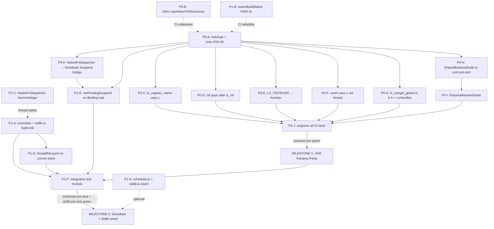

# JVM Completion Roadmap

**Date:** 2026-06-10  
**Status:** Draft  
**Related plans:** `docs/plans/01-project-scaffold-and-build-toolchain.md`, `docs/plans/04-panama-backend-jvm.md`, `docs/plans/06-scheduler-and-task-model.md`, `docs/plans/07-stdlib-and-task-library.md`

---

## 1. Goal Statement

The JVM completion work proceeds in three successive milestones:

1. **JVM/Panama green parity.** The Panama Binding backend passes the same 10 shared contract behaviors (TC-SHARED-01 through TC-SHARED-10) that the WASM/JS backend already passes. All 22 currently-ignored Panama tests are unignored and passing. `./mill panama.test` produces zero failures.

2. **Scheduler and Task Library wired and passing.** The `scheduler.jvm` and `stdlib.jvm` modules are declared in `build.mill`, compile, and their test suites pass against both the `FakeBinding` harness (unit) and the Panama backend (integration). `./mill scheduler.jvm.test` and `./mill stdlib.jvm.test` both pass.

---

## 2. Phase Definitions

### Phase Labels and Effort Scale

| Label | Meaning | Typical scope |
|---|---|---|
| P0 | Blocks everything else — must land first | Correctness bugs, missing build wiring that prevents compilation |
| P1 | Blocks the milestone goal but not other P0s | ABI gaps, architectural seams, integration bridges |
| P2 | High-value but not blocking — can land after green | Structural improvements, Codec coverage, edge cases |
| P3 | Hygiene / risk reduction — deferred to post-green | Dead code removal, structural deduplication |
| S | Small: one focused change, 1–4 hours |  |
| M | Medium: touches 2–4 files with non-trivial logic, 4–16 hours |  |
| L | Large: multiple modules, design decision required, 1–3 days |  |
| XL | Extra-large: new module or subsystem, 1–3 weeks |  |

---

### P0 — Must Land Before Any Panama Test Can Run

#### P0-A: Wire `shim.nativeBuild` output path into `panama.test.forkArgs`

**Area:** `build.mill`, Panama build  
**Effort:** S

`LxHandles.scala` loads the native shared library at class-initialization time (`panama/src/luau/panama/LxHandles.scala:9–11`). It reads `System.getProperty("luau.shim.lib")` and falls back to `System.loadLibrary("luau-shim")`. The fallback fails in any environment where the library is not on the system `LD_LIBRARY_PATH`. The current `build.mill` at lines 46–49 sets only `--enable-native-access=ALL-UNNAMED` and `--enable-preview` in `panama.test.forkArgs` — no `-Dluau.shim.lib=...` property.

Because `LxHandles` is an `object` (a Scala singleton), any access to its members (including object initialization itself) triggers the library load. This means every single Panama test fails at class-initialization before any test body executes — they are all marked `.ignore` specifically to suppress this crash (`panama/test/src/luau/panama/NativeLibSmokeTest.scala:7,13`; `CompileAndRunTest.scala:8,17,29,41,52`; all six test files).

**Fix:** In `build.mill`, extend `panama.test.forkArgs` to include `-Dluau.shim.lib=${shim.nativeBuild().path}`. This makes `panama.test` declare a task dependency on `shim.nativeBuild`, ensuring the library is compiled before tests run and its path is available as a JVM system property.

**Acceptance criteria:** `./mill panama.test` no longer crashes at class-initialization; all tests that previously crashed now reach their test bodies (still skipping if marked `.ignore` — that is addressed separately in P0-D).

**Depends on:** nothing (pure build change).

---

#### P0-B: Add `shim.copyWasmToResources` task to `build.mill`

**Area:** `build.mill`, CI  
**Effort:** S

`ci.yml:46` runs `./mill shim.copyWasmToResources`, but this task does not exist in `build.mill`. The shim object at lines 65–181 defines `nativeBuild`, `wasmBuild`, `wasmBuildNative`, and supporting helpers, but no `copyWasmToResources`. CI will fail at this step with "Task not found". A shell script `shim/copy-wasm-test-resources.sh` exists as a workaround but is not referenced from `build.mill` or CI.

The intended task definition is described in `docs/plans/01-project-scaffold-and-build-toolchain.md:610`.

**Fix:** Add a `def copyWasmToResources: Task[Unit]` to the `shim` object that calls `shim.wasmBuildNative()` and copies the resulting `.wasm` file to the correct test-resources path (or invokes the existing shell script). The wasm module's `jsEnvConfig` already calls `shim.wasmBuildNative()` at `build.mill:56–58`, so `wasmBuildNative` is the correct source artifact.

**Acceptance criteria:** `./mill shim.copyWasmToResources` succeeds without error and produces the `.wasm` file at the location expected by `wasm.test`.

**Depends on:** nothing.

---

#### P0-C: Fix `lx_register_native` called with thread handle instead of main state

**Area:** Panama Binding correctness  
**Effort:** S

`lx_register_native` has signature `void lx_register_native(lx_State state, int32_t fnId, const char* debugname)` (`shim/include/lx.h:314`). The first parameter is `lx_State` — the main Luau state, NOT a coroutine thread.

Two methods in `PanamaState` pass the wrong value:

- `pushFunction` (`panama/src/luau/panama/PanamaState.scala:95–99`): calls `lx_register_native.invokeExact(state, fnId, name)` where `state` is the `thread` argument received by the method, which is a coroutine handle when called from a non-main thread.
- `registerNativeFn` (`PanamaState.scala:197–203`): same error — calls `lx_register_native.invokeExact(state, fnId, name)` where `state` is the thread parameter.

The Shim registers Native functions only on the main state's function table. Passing a coroutine handle results in either a null-pointer dereference inside `lx_register_native` or registration on the wrong state, causing every Native function to be invisible to scripts.

**Fix:** Both `pushFunction` and `registerNativeFn` must pass `L` (the main state handle) as the first argument to `lx_register_native`, not the `state` parameter.

```scala
// pushFunction — correct form:
LxHandles.lx_register_native.invokeExact(L, fnId, name): Unit

// registerNativeFn — correct form:
LxHandles.lx_register_native.invokeExact(L, fnId, name): Unit
```

**Acceptance criteria:** `NativeFunctionTest` (all three cases) passes after unignoring; scripts can call registered Native functions.

**Depends on:** P0-A (library must load before the fix can be verified).

---

#### P0-D: Fix `PanamaState.ref()` — does not pop stack after `lx_ref`

**Area:** Panama Binding correctness  
**Effort:** S

`lx_ref` documentation in `shim/include/lx.h:284` states: "The value remains on the stack (not popped)." `WasmBinding.ref()` explicitly calls `_lx_pop` after `_lx_ref` with comment "consume it off the stack to match luaL_ref semantics" (`wasm/src/luau/wasm/WasmBinding.scala:207–210`).

`PanamaState.ref()` at lines 185–191 calls `lx_ref` but never calls `lx_pop`:

```scala
def ref(state: MemorySegment): Ref[MemorySegment] =
  checkOpen()
  val key = LxHandles.lx_ref.invokeExact(L, state, -1).asInstanceOf[Int]
  if key == -1 then
    throw new IllegalStateException("lx_ref returned LUA_NOREF (stack empty?)")
  val origin = Ref.genOrigin()
  Ref(L, key, this, origin)  // ← no pop
```

TC-SHARED-06 (`wasm/test/src/luau/core/SharedBackendSuite.scala:113–114`) asserts `assertEquals(b.stackTop(state), 0)` immediately after `b.ref(state)`. With PanamaState, `stackTop` will return 1 and this assertion fails.

**Fix:** Add `LxHandles.lx_pop.invokeExact(L, state, 1): Unit` immediately after the `lx_ref` call in `PanamaState.ref()`.

**Acceptance criteria:** TC-SHARED-06 passes; `stackTop` is 0 after `ref()`.

**Depends on:** P0-A.

---

#### P0-E: Fix `LX_TINTEGER` missing from `PanamaState.typeAt` match — integer slots return `LuaType.String`

**Area:** Panama Binding correctness  
**Effort:** S

`PanamaState.typeAt` at lines 104–116 dispatches on the integer type code returned by `lx_type`. It handles `LX_TNONE`, `LX_TNIL`, `LX_TBOOLEAN`, `LX_TNUMBER`, `LX_TSTRING`, `LX_TTABLE`, `LX_TFUNCTION`, `LX_TUSERDATA`, and `LX_TTHREAD` — but not `LX_TINTEGER`. The fallthrough is `LuaType.fromCode(code)`.

`LxConstants.LX_TINTEGER = 4` (`panama/src/luau/panama/LxConstants.scala:17`). `LuaType.String` has `luaCode = 4` (`core/jvm/src/luau/core/LuaType.scala:8`). Therefore any integer slot is misidentified as `LuaType.String`. This will corrupt `typeAt`-based type checks throughout the codebase — notably in `TaskLibrary.registerSpawnFn` which checks `LuaType.Function` before spawning, and in Codec decoders.

Note: `LuaType` itself does not have an `Integer` variant. The correct mapping is `LX_TINTEGER => LuaType.Number`, consistent with how WasmBinding handles type code 4 (`wasm/src/luau/wasm/WasmBinding.scala:108`, which maps 4 to `LuaType.Number`). Luau integers are a subtype of number in the Luau VM.

**Fix:** Add `case LX_TINTEGER => LuaType.Number` to the `typeAt` match before the fallthrough. Also add `case LX_TVECTOR => LuaType.Userdata` (or a distinct extension) for completeness, consistent with WasmBinding's treatment.

**Acceptance criteria:** Integer-typed stack slots return `LuaType.Number` from `typeAt`. TC-SHARED-01 (which pushes `42`, an integer in Luau's internal representation) correctly reads back via `toNumber`.

**Depends on:** P0-A.

---

#### P0-F: Fix `PanamaState.unref()` — passes thread handle instead of main state to `lx_unref`

**Area:** Panama Binding correctness  
**Effort:** S

`lx_unref` signature is `void lx_unref(lx_State state, int ref)` (`shim/include/lx.h:293–294`). The first parameter must be the main `lx_State`.

`PanamaState.unref` at line 193–195:

```scala
def unref(state: MemorySegment, key: Int): Unit =
  if !closed then
    LxHandles.lx_unref.invokeExact(state, key): Unit
```

`state` here is the thread/state argument passed to `unref` — when called from `Ref.close()`, this is `L` (the state stored in the `Ref`), which is correct. However when called from code that passes a coroutine thread handle (e.g., inside a `Scope` that captured a Ref via a thread), the wrong state is passed. The `setGlobal` method in the same file correctly uses `lx_unref.invokeExact(L, saved)` (line 215), showing the intended pattern.

For safety, `PanamaState.unref` should always pass `L` (the main state), not the parameter:

```scala
def unref(state: MemorySegment, key: Int): Unit =
  if !closed then
    LxHandles.lx_unref.invokeExact(L, key): Unit
```

**Acceptance criteria:** `RefLifecycleTest` passes; `Ref.close()` on Refs created from thread-context stacks does not crash or silently fail.

**Depends on:** P0-A, P0-D.

---

#### P0-G: Add `lx_set_global` / `lx_get_global` to `lx.h` and `LxHandles.scala`; use them in `PanamaState`

**Area:** Panama ABI, Shim public header  
**Effort:** S

`lx_set_global` and `lx_get_global` are implemented in `shim/src/lx.cpp:332–340` and are listed in the WASM `EXPORTED_FUNCTIONS` at `build.mill:143`. However they are absent from `shim/include/lx.h` (the public ABI header) and have no `MethodHandle` in `LxHandles.scala`.

`PanamaState.getGlobal` (lines 205–207) emulates `lx_get_global` via: push name string + `lx_rawget` on `LUA_GLOBALSINDEX = -10002`. The magic constant `-10002` is computed as `-(LUAI_MAXCSTACK) - 2002` where `LUAI_MAXCSTACK = 8000` (`shim/luau/luaconf.h`). If Luau changes this constant, `getGlobal` silently accesses the wrong pseudo-index.

`PanamaState.setGlobal` (lines 209–215) uses a 5-step workaround: `lx_ref` the value, pop, push name, push ref back, `lx_rawset`, `lx_unref` — 5 FFI round-trips vs. 1, and not atomic.

`WasmBinding.getGlobal` / `setGlobal` (lines 224–232) call `_lx_get_global` / `_lx_set_global` directly.

**Fix:**
1. Add declarations to `shim/include/lx.h`:
   ```c
   void lx_set_global(lx_State state, const char* name);
   void lx_get_global(lx_State state, const char* name);
   ```
2. Add `MethodHandle` entries to `LxHandles.scala`:
   ```scala
   val lx_set_global: MethodHandle = handle("lx_set_global",
     FunctionDescriptor.ofVoid(ADDRESS, ADDRESS))
   val lx_get_global: MethodHandle = handle("lx_get_global",
     FunctionDescriptor.ofVoid(ADDRESS, ADDRESS))
   ```
3. Replace the multi-step workarounds in `PanamaState.getGlobal` / `setGlobal` with single-call invocations.

**Acceptance criteria:** TC-SHARED-04 passes (Native function callable from script via `setGlobal`/`getGlobal`); `setGlobal` is a single FFI call.

**Depends on:** P0-A.

---

#### P0-H: Extract `SharedBackendSuite` to `core.jvm.test` so `panama.test` can extend it

**Area:** Test infrastructure  
**Effort:** M

`SharedBackendSuite` is currently located at `wasm/test/src/luau/core/SharedBackendSuite.scala` under package `luau.core`. `wasm` is declared as a `ScalaJSModule` in `build.mill:53–63`. Panama's test module (`panama.test`) depends on `core.jvm`, not on `wasm` — and it cannot, because `wasm` compiles to JS bytecode, not JVM bytecode.

To run TC-SHARED-01 through TC-SHARED-10 on the Panama backend, `SharedBackendSuite` must be reachable from `panama.test`. The clean solution is to move the abstract class to `core/jvm/test/src/luau/core/SharedBackendSuite.scala` (or a dedicated shared-test source directory) and have both `wasm.test` and `panama.test` depend on it.

Options:
- **Option A (simpler):** Move `SharedBackendSuite.scala` into `core/jvm/test/src/`. Add `panama.test.moduleDeps += core.jvm.test` and `wasm.test.moduleDeps += core.jvm.test` (Mill supports test-module cross-deps when the source module is JVM). Update `WasmBackendSuite` to compile against this new location.
- **Option B (isolated):** Create a `object sharedTest extends ScalaModule` with just the abstract suite and have both backends depend on it.

Option A is recommended as lower-overhead given the small surface of the shared suite.

**Acceptance criteria:** `panama.test` compiles with `SharedBackendSuite` visible; a stub `PanamaBackendSuite` (even empty) can extend it without import errors.

**Depends on:** P0-A.

---

#### P0-I: Create `PanamaBackendSuite` extending `SharedBackendSuite`

**Area:** Test infrastructure  
**Effort:** M

With `SharedBackendSuite` accessible from `panama.test` (P0-H), the concrete adapter class must be written. `WasmBackendSuite` at `wasm/test/src/luau/wasm/WasmBackendSuite.scala` provides the pattern:

```scala
class WasmBackendSuite extends SharedBackendSuite:
  override def withBinding[A](f: Binding[Int] => A): A =
    WasmBackend.load()
    f(WasmBackend.createBinding())
```

`SharedBackendSuite.withBinding` takes `Binding[Int]`. For Panama, `H = MemorySegment`. However `SharedBackendSuite` is parameterized as `Binding[Int]` in the WASM suite because it uses the JS integer-handle model. For Panama, the suite must either be made generic over `H` or a thin adapter `PanamaIntBinding` must wrap `PanamaState` to present `Binding[Int]` with registry keys as the handle.

The simpler path is to make `SharedBackendSuite` abstract over `H` (`abstract class SharedBackendSuite[H]`) with a single `withBinding[A](f: Binding[H] => A): A` abstract method. This requires updating `WasmBackendSuite`.

`PanamaState.newState()` throws `UnsupportedOperationException` (`PanamaState.scala:24–25`). The `withBinding` implementation for Panama cannot call `b.newState()` — it must call `PanamaState.open()` directly and wrap the result.

**Acceptance criteria:** `PanamaBackendSuite` file exists; `./mill panama.test` executes TC-SHARED-01 through TC-SHARED-10 (they may fail until P0-C through P0-G are also landed, but they must execute without being skipped).

**Depends on:** P0-A, P0-H.

---

#### P0-J: Unignore all 22 Panama tests after correctness fixes

**Area:** Test infrastructure  
**Effort:** S

Once P0-A through P0-I are complete, all `.ignore` annotations in the six Panama test files should be removed:

- `panama/test/src/luau/panama/CompileAndRunTest.scala` (5 tests, lines 8, 17, 29, 41, 52)
- `panama/test/src/luau/panama/NativeFunctionTest.scala` (3 tests, lines 8, 25, 43)
- `panama/test/src/luau/panama/NativeLibSmokeTest.scala` (2 tests, lines 7, 13)
- `panama/test/src/luau/panama/RefLifecycleTest.scala` (4 tests, lines 8, 21, 30, 45)
- `panama/test/src/luau/panama/StringMarshalTest.scala` (5 tests, lines 8, 15, 24, 31, 38)
- `panama/test/src/luau/panama/SuspendResumeTest.scala` (3 tests, lines 7, 26, 56)

`SuspendResumeTest` tests depend on the Suspension plumbing (P1-E below); they should be unignored last or given a separate tracking note.

**Acceptance criteria:** `./mill panama.test` reports 22 passing (0 ignored, 0 failing).

**Depends on:** P0-A, P0-C, P0-D, P0-E, P0-F, P0-G, P0-I; P1-E for `SuspendResumeTest`.

---

#### P0-K: Wire `NativeFnDispatcher.Suspend` path to `Scheduler.pendingSuspend`

**Area:** Suspension / Async primitive / Scheduler integration  
**Effort:** M

This is the most architecturally significant correctness gap for the Scheduler milestone.

When a Native function returns `NativeFnResult.Suspend`, `NativeFnDispatcher.dispatch()` stores the `Suspend` in `SuspendRegistry` keyed by a 64-bit token and sets `panamaState.lastYieldToken` (`panama/src/luau/panama/NativeFnDispatcher.scala:52–57`).

The `Scheduler.resumeTask()` path (`scheduler/jvm/src/luau/scheduler/Scheduler.scala:207–213`) calls `takePendingSuspend()` after `lx_resume` returns `Yielded`. `takePendingSuspend()` reads from `Scheduler.pendingSuspend` — a private field set only via `setPendingSuspend(s: Suspend)` (`Scheduler.scala:45–46`). `setPendingSuspend` is `private[scheduler]` and is never called by `NativeFnDispatcher` or `PanamaState`.

Result: on every real Suspend, the Scheduler sees `Yielded` + `takePendingSuspend() == None`, parks the Task forever with no wiring, and the async operation is permanently lost.

The current Scheduler unit tests paper over this by calling `sched.setPendingSuspend(async.suspend)` manually before `spawn()` (`scheduler/jvm/test/src/luau/scheduler/SchedulerTests.scala:25,44`). Integration tests are all pending.

**Three design options:**

1. **Add `setPendingSuspend` / `takePendingSuspend` to the `Binding` trait.** The `NativeFnDispatcher` already has a reference to the `PanamaState`; it can call `binding.setPendingSuspend(s)` after storing the token. The Scheduler reads via the same interface. Requires extending `Binding.scala`.

2. **Pass a `Scheduler` reference into `NativeFnDispatcher`.** After storing in `SuspendRegistry`, call `scheduler.setPendingSuspend(s)` directly. Introduces a circular dependency concern (`panama` → `scheduler` → `core`), which the current module graph avoids.

3. **Post-resume bridge: Scheduler reads from SuspendRegistry.** After `lx_resume` returns `Yielded`, the Scheduler calls `panamaState.suspendRegistry.consume(panamaState.lastYieldToken)` to retrieve the `Suspend`. Requires exposing `lastYieldToken` and `suspendRegistry` on the `Binding` trait or via a `SuspendableBinding` sub-trait.

Option 1 is recommended: it keeps `NativeFnDispatcher` and `Scheduler` both referring to `Binding` (a `core` abstraction), avoids new dependencies, and is consistent with how `WasmBinding` will eventually need to handle this path. The `FakeBinding` test implementation can expose the pending suspend for unit-test inspection.

**Acceptance criteria:** `SuspendResumeTest` passes end-to-end (Suspend → Yielded, resume delivers value, Returned); the Scheduler's `TC-06` integration test passes with a real Panama backend.

**Depends on:** P0-A, P0-J (tests must be unignorable).

---

### P1 — Blocks Milestone Goals, Lands After P0

#### P1-A: Add `scheduler.jvm` and `stdlib.jvm` modules to `build.mill`

**Area:** build.mill  
**Effort:** S

`build.mill` currently defines only `core.jvm`, `core.js`, `panama`, `wasm`, `shim`. Source trees for `scheduler/jvm/` and `stdlib/jvm/` exist on disk with full implementations but are invisible to Mill. `./mill scheduler.jvm.test` and `./mill stdlib.jvm.test` cannot run.

Required additions to `build.mill`:

```scala
object scheduler extends Module {
  object jvm extends LuauCrossPlatformModule {
    override def moduleDeps = super.moduleDeps ++ Seq(core.jvm)
    object test extends ScalaTests with TestModule.Munit {
      override def moduleDeps = super.moduleDeps ++ Seq(scheduler.jvm)
      def mvnDeps = Seq(mvn"org.scalameta::munit::${build.munitVersion}")
    }
  }
}

object stdlib extends Module {
  object jvm extends LuauCrossPlatformModule {
    override def moduleDeps = super.moduleDeps ++ Seq(scheduler.jvm)
    object test extends ScalaTests with TestModule.Munit {
      override def moduleDeps = super.moduleDeps ++ Seq(stdlib.jvm, scheduler.jvm.test)
      def mvnDeps = Seq(mvn"org.scalameta::munit::${build.munitVersion}")
    }
  }
}
```

Note: `stdlib.jvm.test` must declare `moduleDeps` on `scheduler.jvm.test` (not just `scheduler.jvm`) because `StdlibSuite.scala` imports `luau.scheduler.TestBinding` and `makeScheduler` from `scheduler/jvm/test/src/luau/scheduler/TestHelpers.scala`. Mill does not export test sources via normal `moduleDeps`; the test-module cross-dependency is required.

**Acceptance criteria:** `./mill scheduler.jvm.compile` and `./mill stdlib.jvm.compile` succeed; `./mill scheduler.jvm.test` runs (may need further fixes to pass all tests, but must execute).

**Depends on:** nothing (pure `build.mill` change, no source edits needed).

---

#### P1-B: Fix `panama.test.forkArgs` CI path for native library — `wasmBuildNative` uses `sys.env("PWD")`

**Area:** `build.mill`, CI  
**Effort:** S

`shim.wasmBuildNative` at `build.mill:169` reads `sys.env("PWD")` directly:

```scala
def wasmBuildNative = Task {
  val projectRoot = os.Path(sys.env("PWD"))
  ...
```

In CI environments where `PWD` is not set (some non-interactive shells, containers), this throws `NoSuchElementException`. The idiomatic Mill equivalent is `Task.workspace` or `os.pwd` (which resolves against the Mill working directory, guaranteed to be the repo root). This is a CI reliability issue that can manifest when `wasm.test` runs (which calls `wasmBuildNative`).

**Fix:** Replace `sys.env("PWD")` with `os.pwd` in `shim.wasmBuildNative`.

**Acceptance criteria:** `./mill shim.wasmBuildNative` succeeds in a shell where `PWD` is unset.

**Depends on:** nothing.

---

#### P1-C: Fix `NativeFnDispatcher.nextId` — not thread-safe

**Area:** Panama NativeFn dispatch  
**Effort:** S

`NativeFnDispatcher.nextId` is a plain `var` incremented without synchronization (`panama/src/luau/panama/NativeFnDispatcher.scala:13,18–22`). `fns` is a `ConcurrentHashMap` (thread-safe for lookups), but the id allocation sequence is not atomic. Concurrent calls to `register()` can produce duplicate `fnId` values, causing one Native function to silently overwrite another in the `fns` map.

The practical risk is low today (Native functions are registered at startup before the Driver runs), but `TaskLibrary.install` registers 5 functions at `StdlibOpener.open` time, and future dynamic registration could trigger the race.

**Fix:** Replace `var nextId = 1` with `private val nextId = new java.util.concurrent.atomic.AtomicInteger(1)` and change `register()` to use `nextId.getAndIncrement()`.

Note: `SuspendRegistry` already uses `AtomicLong` for the analogous pattern (`panama/src/luau/panama/SuspendRegistry.scala:9`).

**Acceptance criteria:** `register()` is safe for concurrent calls; two threads registering simultaneously cannot receive the same `fnId`.

**Depends on:** nothing.

---

#### P1-D: Fix `TaskLibrary.registerSpawnFn` — `handle.threadRef.push()` pushes onto wrong stack

**Area:** `stdlib.jvm`, Task library  
**Effort:** S

`TaskLibrary.registerSpawnFn` at `stdlib/jvm/src/luau/stdlib/TaskLibrary.scala:53` calls `handle.threadRef.push()` to return the thread Ref to the script as the result of `task.spawn(fn)`. `Ref.push()` in `core/jvm/src/luau/core/Ref.scala:12–14` calls `binding.pushRef(state, registry)` where `state` is the `state` field stored in the `Ref` at creation time.

For a `threadRef` created by `Scheduler.spawnImmediate` (which calls `binding.ref(state)` on the main state `H`), the `Ref.state` is the main state handle `L`. `push()` therefore pushes onto the main state's stack, not onto the active coroutine's stack `s` (the thread executing the `task.spawn` Native function call).

The `FakeBinding` / `FakeState` test harness hides this bug because `FakeBinding.pushRef` ignores the state argument and pushes onto a global fake stack (`core/jvm/test` — `FakeBinding.scala`). With a real Panama backend, the return value lands on the wrong stack.

The same bug exists in `registerDeferFn` (line 75) and `registerDelayFn` (line 96).

**Fix:** Replace `handle.threadRef.push()` with `binding.pushRef(s, handle.threadRef.registryKey)` in all three registration functions, where `s` is the Native function's active thread parameter.

**Acceptance criteria:** After `task.spawn(fn)`, the return value (thread handle) is present on the active coroutine's stack at position 1; integration tests with a real Panama backend confirm the value is a valid thread reference.

**Depends on:** P1-A.

---

#### P1-E: Expose Suspension API on `Binding` trait for portable `setPendingSuspend` / `takePendingSuspend`

**Area:** `core`, `Binding` trait  
**Effort:** M

`Scheduler.resumeTask()` calls `takePendingSuspend()` which is defined only on `Scheduler[H]` itself (`scheduler/jvm/src/luau/scheduler/Scheduler.scala:48–51`). `NativeFnDispatcher.dispatch()` (which runs during `lx_resume`) has a reference to `PanamaState` but not to `Scheduler`. The gap between the two is why the Suspend side-channel is currently disconnected (see P0-K).

The recommended fix (Option 1 from P0-K) requires adding two methods to `Binding`:

```scala
// In core/jvm/src/luau/core/Binding.scala
def setPendingSuspend(s: NativeFnResult.Suspend): Unit = ()  // default: no-op
def takePendingSuspend(): Option[NativeFnResult.Suspend] = None  // default: None
```

With default implementations, no existing `Binding` implementors (FakeBinding, WasmBinding) need changes. `PanamaState` overrides both methods, using `lastYieldToken` and `suspendRegistry` internally. `Scheduler.resumeTask()` is updated to call `binding.takePendingSuspend()` instead of `takePendingSuspend()` (its own method), reading through the Binding interface.

`NativeFnDispatcher.dispatch()` on `Suspend` calls `panamaState.setPendingSuspend(s)` after storing the token.

**Acceptance criteria:** The Scheduler correctly wires Suspension when a Native function returns `NativeFnResult.Suspend` through the Panama backend without any test-side `setPendingSuspend` injection.

**Depends on:** P0-K (design decision), P0-A.

---

#### P1-F: Add integration module for Panama + Scheduler end-to-end tests

**Area:** Build / test infrastructure  
**Effort:** M

`scheduler.jvm.test` uses only `FakeBinding` / `TestBinding` (`scheduler/jvm/test/src/luau/scheduler/SchedulerTests.scala`). `stdlib.jvm.test` uses only `TestBinding` and `CallOrderBinding` (`stdlib/jvm/test/src/luau/stdlib/StdlibSuite.scala`). Neither exercises the real Panama backend.

A new integration test module (e.g., `object integration extends LuauCrossPlatformModule`) with `moduleDeps = Seq(core.jvm, panama, scheduler.jvm, stdlib.jvm)` and matching `forkArgs` (native library path) is needed to host:

- **ITC-01:** Compile and run a script that calls `task.spawn(fn)` with a Native function using the real Panama backend.
- **ITC-02:** `task.wait(0.01)` suspends a Task and is resumed by the timer (end-to-end Async primitive flow).

These tests correspond to the integration test cases described in `docs/plans/06-scheduler-and-task-model.md §4.8` (currently marked pending).

**Acceptance criteria:** `./mill integration.test` (or equivalent module name) passes ITC-01 and ITC-02 with a live `PanamaState`.

**Depends on:** P1-A, P1-D, P1-E, P0-A, P0-K.

---

### P2 — High Value, Non-Blocking

#### P2-A: Add `scheduler.js`, `stdlib.js` module declarations to `build.mill` (stub wiring)

**Area:** `build.mill`  
**Effort:** S (build wiring) + XL (implementation)

`scheduler/js` and `stdlib/js` directories exist on disk but contain no source files. `build.mill` has no module declarations for them. Plan 01 §2.3 specifies these as part of the cross-platform module graph.

This item splits into two:

1. **P2-A1 (S):** Add empty `scheduler.js` and `stdlib.js` module stubs to `build.mill` — just enough to declare the module with `moduleDeps` on `core.js`. This prevents the "module not found" error if CI is ever extended to run `__.compile` on all modules.

2. **P2-A2 (XL):** Implement the JS-side scheduler and stdlib, porting the JVM logic to Scala.js idioms. This is deferred until the JVM implementations are stable and passing.

**Depends on:** P1-A (use the JVM implementation as the template).

---

#### P2-B: Deduplicate `core.jvm` and `core.js` source trees

**Area:** `build.mill`, `core` module  
**Effort:** M

`core/js/src` is currently a filesystem symlink pointing to `../jvm/src`. This works but is fragile: it breaks if any tooling creates files inside `core/js/src/` (the symlink would need to become a real directory), it is invisible to git (git tracks the symlink target, not individual files), and it relies on an implicit convention rather than an explicit build declaration. The correct fix is to remove the symlink and declare the shared sources explicitly in `build.mill`.

Plan 01 §2.3 specifies that `core.js` should override `sources` to point at the JVM source directory.

**Fix:** In `build.mill`, add to `core.js`:
```scala
override def sources = Task { core.jvm.sources() }
```
Then delete `core/js/src/` (it becomes redundant once sourced from `core/jvm/src/`).

**Acceptance criteria:** `./mill core.js.compile` succeeds from the single JVM source tree; `core/js/src/` directory is removed.

**Depends on:** nothing (pure structural change, no logic change).

---

#### P2-C: Fix `PanamaRef` / `Ref[MemorySegment]` duality — unify Scope/Ref lifecycle types

**Area:** Panama Ref management  
**Effort:** M

Two distinct ref lifecycle types coexist in the `panama` module:

- `Ref[MemorySegment]` from `core` — returned by `PanamaState.ref()`, implements `AutoCloseable`, `push()` pushes onto the state stored at creation.
- `PanamaRef` (`panama/src/luau/panama/PanamaRef.scala:6–17`) — has `push(thread: MemorySegment)` requiring an explicit thread, managed by `PanamaScope`.
- `PanamaScope` (`panama/src/luau/panama/PanamaScope.scala`) — manages `PanamaRef` instances, backed by a `java.lang.foreign.Arena`.

`RefLifecycleTest` uses `ps.ref(ps.L)` returning `Ref[MemorySegment]` and `ps.pushRef(ps.L, ref.registryKey)` directly (bypassing `Ref.push()`). `PanamaState.scoped` uses `Scope[MemorySegment]` from `core`, not `PanamaScope`.

A single Ref type is needed. The recommended resolution is to deprecate and remove `PanamaRef` / `PanamaScope` in favor of the `core` `Ref[MemorySegment]` pair, ensuring `Ref.push()` correctly pushes onto the active thread (not stored main-state `L`) when the Ref is used from a coroutine context.

**Depends on:** P0-D, P0-F.

---

#### P2-D: Add `PanamaSink` integration tests against real state

**Area:** Panama Codec / Sink  
**Effort:** M

`PanamaSink.pushValue` at `panama/src/luau/panama/PanamaSink.scala:27–29` encodes a value then calls `binding.rawSet(state, -3)`, assuming the table is at index -3. `pushArrayValue` calls `binding.setArray(state, -2, n)` assuming the table is at -2. These stack layout assumptions are undocumented and untested against a real Luau state. The existing `core/jvm/test/src/luau/core/codec/CodecSpec.scala` tests Codec encoding only against `FakeBinding`.

**Fix:** Add a `PanamaSinkSuite` in `panama/test/` that constructs a real `PanamaState`, creates a `PanamaSink`, encodes various Scala types (`Int`, `String`, `List[Double]`), and reads the results back via `Binding` table operations to verify correctness.

**Depends on:** P0-J (tests must be unignored for Panama integration tests to work).

---

#### P2-E: Add wasm module — two independent Binding stacks test (JVM equivalent of TC-WASM-04)

**Area:** Panama test coverage  
**Effort:** S

`wasm/test/src/luau/wasm/WasmSpecificSuite.scala TC-WASM-04` verifies that two `WasmBinding` instances have independent stacks. The equivalent JVM test verifies that two `PanamaState` instances created via `PanamaState.open()` have independent stacks. `NativeLibSmokeTest` has a lifecycle test but no independence test.

**Depends on:** P0-J.

---

### P3 — Hygiene and Risk Reduction

#### P3-A: Remove `LuauShimBindings.scala` dead stub

**Area:** Panama dead code  
**Effort:** S

`panama/src/generated/LuauShimBindings.scala` is an early auto-generated stub with wrong signatures (`lx_version` not in ABI; `lx_resume` with only 2 parameters vs. the actual 4). It is never imported by any file in `panama/src/` (`rg 'LuauShimBindings' panama/src/` returns no hits outside the generated file itself). It introduces symbol clutter and risks confusing contributors about the canonical downcall layer.

**Depends on:** nothing.

---

#### P3-B: Move `lx_set_global` / `lx_get_global` into `lx.h` — formalize or remove from WASM exports

**Area:** Shim public header, WASM export list  
**Effort:** S

This is a consequence of P0-G. After adding `lx_set_global` / `lx_get_global` to `lx.h` (P0-G), they are formalized as part of the public ABI. The `build.mill` WASM `EXPORTED_FUNCTIONS` list at line 143 already exports `_lx_set_global` / `_lx_get_global`. After P0-G lands, this is correct and no longer a discrepancy.

If it is decided NOT to add them to `lx.h` (e.g., if the WASM backend switches to a different global-access strategy), they should be removed from `EXPORTED_FUNCTIONS`.

**Depends on:** P0-G.

---

#### P3-C: Document `lx_ref` "value remains on stack" behavior — add assertion or comment

**Area:** Shim documentation  
**Effort:** S

The `lx_ref` contract ("value remains on the stack, not popped") diverges from Lua's `luaL_ref` (which pops). Both `WasmBinding` and `PanamaState` (after P0-D fix) explicitly pop after `lx_ref`, but the reason is non-obvious to future contributors. A comment in `lx.h` and in both Binding implementations will prevent regressions.

**Depends on:** P0-D.

---

#### P3-D: Deduplicate `core.js` source tree (see P2-B)

Already listed as P2-B. Repeated here only to note that if it is delayed past the P2 window, it becomes a P3 hygiene item.

---

## 3. Dependency-Ordered Execution Sequence

The following Mermaid graph shows the dependency ordering from blocking-root to milestone end states.



The critical path to Milestone 1:
**P0-A → [P0-C, P0-D, P0-E, P0-F, P0-G, P0-H → P0-I] → P0-J**

The critical path to Milestone 2:
**P0-K → P1-E; P1-A → P1-D; [P1-D, P1-E, Milestone 1] → P1-F**

---

## 4. Work Item Summary Table

| ID | Phase | Area | Title | Effort | Depends On |
|---|---|---|---|---|---|
| P0-A | P0 | build.mill | Wire `shim.nativeBuild` path into `panama.test.forkArgs` | S | — |
| P0-B | P0 | build.mill / CI | Add `shim.copyWasmToResources` task | S | — |
| P0-C | P0 | Panama ABI | Fix `lx_register_native` called with thread instead of main state | S | P0-A |
| P0-D | P0 | Panama Binding | Fix `ref()` — does not pop stack after `lx_ref` | S | P0-A |
| P0-E | P0 | Panama Binding | Fix `LX_TINTEGER` missing from `typeAt` match | S | P0-A |
| P0-F | P0 | Panama Binding | Fix `unref()` — passes thread handle instead of main state | S | P0-A, P0-D |
| P0-G | P0 | Panama ABI / Shim | Add `lx_set_global` / `lx_get_global` to `lx.h` and `LxHandles` | S | P0-A |
| P0-H | P0 | Test infra | Extract `SharedBackendSuite` to `core.jvm.test` | M | P0-A |
| P0-I | P0 | Test infra | Create `PanamaBackendSuite` extending `SharedBackendSuite` | M | P0-A, P0-H |
| P0-J | P0 | Test infra | Unignore all 22 Panama tests | S | P0-C thru P0-I |
| P0-K | P0 | Suspension | Wire `NativeFnDispatcher.Suspend` to `Scheduler.pendingSuspend` | M | P0-A |
| P1-A | P1 | build.mill | Add `scheduler.jvm` + `stdlib.jvm` to `build.mill` | S | — |
| P1-B | P1 | build.mill / CI | Fix `wasmBuildNative` `sys.env("PWD")` → `os.pwd` | S | — |
| P1-C | P1 | Panama dispatch | Fix `NativeFnDispatcher.nextId` thread safety | S | — |
| P1-D | P1 | stdlib | Fix `taskLibrary.threadRef.push()` pushes onto wrong stack | S | P1-A |
| P1-E | P1 | core / Binding | Expose `setPendingSuspend` / `takePendingSuspend` on `Binding` | M | P0-K |
| P1-F | P1 | Test infra | Integration test module (ITC-01, ITC-02) with Panama backend | M | P1-A, P1-D, P1-E, P0-A, P0-K |
| P2-A | P2 | build.mill | Add `scheduler.js` / `stdlib.js` stub modules | S+XL | P1-A |
| P2-B | P2 | build.mill / core | Deduplicate `core.jvm` / `core.js` source trees | M | — |
| P2-C | P2 | Panama Ref | Unify `PanamaRef` / `Ref[MemorySegment]` lifecycle types | M | P0-D, P0-F |
| P2-D | P2 | Panama Codec | Add `PanamaSink` integration tests against real state | M | P0-J |
| P2-E | P2 | Panama tests | Two-PanamaState stack independence test | S | P0-J |
| P3-A | P3 | Panama dead code | Remove `LuauShimBindings.scala` stub | S | — |
| P3-B | P3 | Shim header | Formalize `lx_set_global` / `lx_get_global` in ABI or remove from exports | S | P0-G |
| P3-C | P3 | Documentation | Document `lx_ref` "value remains on stack" behavior | S | P0-D |

---

## 5. Risks and Unknowns

### R1: `PanamaState.compileAndLoad` pushes chunk onto main state — Scheduler must transfer to coroutine

`lx_compile_and_load` documentation in `shim/include/lx.h:90–92` states: "On success: the compiled chunk is pushed as a function onto the MAIN thread's stack." `PanamaState.compileAndLoad` (`PanamaState.scala:30–51`) passes the main state `L` as the first argument, which is correct.

`Scheduler.spawnImmediate` (`scheduler/jvm/src/luau/scheduler/Scheduler.scala:67–97`) creates a new Coroutine via `newThread`, then calls `pushRef(rawThread, fnRef.registryKey)` to push the function onto the coroutine's stack before `resume`. This works correctly when the function was first pinned into the registry via `ref(state)` — the Ref holds the function by registry key, and `pushRef` copies it to the coroutine.

However `Scheduler.spawn()` (lines 55–63) does NOT push any function onto the coroutine — it just creates a thread and enqueues it. If a caller uses `spawn()` expecting the chunk to be on the coroutine's stack automatically, nothing will execute. The correct pattern is: `compileAndLoad(L, ...)` → `ref(L)` → `spawnImmediate(fnRef, Nil)`. This sequencing is not currently validated by any integration test (all are pending). Risk: first real end-to-end Panama script execution may reveal sequencing bugs.

**Mitigation:** ITC-01 (P1-F) must exercise `compileAndLoad` → `ref` → `spawnImmediate` with a real PanamaState and verify the script executes.

---

### R2: `LuaType` enum `luaCode` values do not match Luau VM constants

`core/jvm/src/luau/core/LuaType.scala:3–12` assigns `luaCode` as sequential integers:

```scala
enum LuaType(val luaCode: Int):
  case None     extends LuaType(-1)
  case Nil      extends LuaType(0)
  case Boolean  extends LuaType(1)
  case Number   extends LuaType(3)
  case String   extends LuaType(4)   // ← conflicts with LX_TINTEGER=4
  case Table    extends LuaType(5)   // ← conflicts with LX_TVECTOR=5
  case Function extends LuaType(6)   // ← LX_TSTRING=6
  ...
```

`LX_TSTRING = 6`, `LX_TTABLE = 7`, `LX_TFUNCTION = 8` per `LxConstants.scala:19–24`. `LuaType.String.luaCode = 4` but `LX_TSTRING = 6`. This means `LuaType.fromCode` is broken for nearly all non-nil types when called with real Luau type codes.

`PanamaState.typeAt` avoids `LuaType.fromCode` by explicit pattern matching on `LxConstants` values — so the `typeAt` path is correct (after P0-E fixes the `LX_TINTEGER` gap). However any code that calls `LuaType.fromCode(code)` with a Shim type code will produce wrong results. The fallthrough `case _ => LuaType.fromCode(code)` in `typeAt` is therefore dangerous.

**Risk level:** Medium. The `LuaType.luaCode` values appear to be defined for Codec/internal use (as stable identifiers for the Scala enum variants) rather than as Luau VM type codes. If any code path reaches `LuaType.fromCode` with a Luau type code from the Shim, it will silently return the wrong type. 

**Mitigation (P1):** Replace the `case _ => LuaType.fromCode(code)` fallthrough in `PanamaState.typeAt` with `case code => throw IllegalArgumentException(s"unknown Luau type code $code")`. This makes unknown type codes fail loudly. Add `case LX_TVECTOR => LuaType.Userdata` and `case LX_TBUFFER => LuaType.Userdata` (or introduce new `LuaType` variants) to cover the full `lx.h` type set.

---

### R3: `NativeFnDispatcher.dispatch` passes `thread` to `SuspendRegistry` but `SuspendResumeTest` reads token via `ps.lastYieldToken`

`SuspendResumeTest` (all three tests) reads `ps.lastYieldToken` after resume yields (`SuspendResumeTest.scala:44`), then calls `ps.suspendRegistry.consume(token)`. This works for a single-threaded test. In a multi-Task scenario where two Tasks yield concurrently, `lastYieldToken` is a single `@volatile var` that will be overwritten by the second yield before the first is consumed. The `SuspendRegistry` keyed by `Long` token is correct; `lastYieldToken` as a single slot is not safe for concurrent yields.

For single-Driver (one-at-a-time resume) operation this is safe: only one Task is inside `lx_resume` at a time, so only one `lastYieldToken` can be active per resume cycle. The risk materializes if a future multi-Driver design is considered.

**Mitigation:** Document the single-Driver assumption on `lastYieldToken` with a comment. After P1-E lands, the `lastYieldToken` should be read and consumed within the `Scheduler.resumeTask()` flow immediately after `Yielded` is observed, not deferred.

---

### R4: `wasmBuild` (Emscripten) task produces unreachable artifacts in CI

`ci.yml:44` runs `./mill shim.wasmBuild` using Emscripten. This produces `luau-shim.js` + `luau-shim.wasm` via the Emscripten toolchain. The `wasm.test` module uses `shim.wasmBuildNative()` (WASI/clang, `build.mill:56`), not `shim.wasmBuild()`. The Emscripten artifact is never consumed by any test. Every CI run installs emsdk from source (no cache, `ci.yml:27`), adding significant build time for an unused artifact.

**Mitigation (P2):** Remove the `Build WASM shim (emcc)` step from CI and the `shim.wasmBuild` invocation entirely, replacing it with just `shim.wasmBuildNative`. If `wasmBuild` is retained for future browser/emscripten targets, add a CI cache for emsdk and move the step to a separate optional CI job.

---

### R5: `TestBinding.newThread` pushes `LuaValue.Nil` — mismatches `PanamaState.newThread`

`TestBinding.newThread` in `scheduler/jvm/test/src/luau/scheduler/TestHelpers.scala:37–40` pushes a `LuaValue.Nil` onto the main state's stack after creating the thread. This simulates a coroutine value on the stack (to model `lx_new_thread` pushing the coroutine onto the main stack before returning). `PanamaState.newThread` (`PanamaState.scala:72–74`) calls `lx_new_thread` and returns the result without pushing anything extra.

`lx.h:78` documents `lx_new_thread`: "The new thread starts in SUSPENDED state with an empty stack." The comment at line 72–78 does NOT say `lx_new_thread` pushes the coroutine onto the main state's stack — it says the new thread has an empty stack. Therefore the `TestBinding.newThread` simulation of pushing `Nil` is incorrect as a model of `lx_new_thread`.

This mismatch means `Scheduler.spawn()` in unit tests sees `stackTop(state) == 1` after `newThread`, while in Panama tests it would see `stackTop(state) == 0`. Any Scheduler code that checks stack state after `newThread` will behave differently in unit tests vs. integration tests.

**Mitigation:** Verify in `shim/src/lx.cpp` whether `lx_new_thread` pushes onto the main state's stack. If it does not, remove the `state.stack.addOne(LuaValue.Nil)` from `TestBinding.newThread`. The integration test ITC-01 (P1-F) will expose this.

---

## 6. Milestone Acceptance Criteria Summary

| Milestone | Command | Success condition |
|---|---|---|
| M1: JVM Panama parity | `./mill panama.test` | 22 passing, 0 ignored, 0 failing |
| M1: Shared contract | Covered by `panama.test` (TC-SHARED-01..10 via `PanamaBackendSuite`) | TC-SHARED-01 through TC-SHARED-10 all pass on JVM |
| M2: Scheduler unit | `./mill scheduler.jvm.test` | All SchedulerTests (TC-01..08) passing |
| M2: Stdlib unit | `./mill stdlib.jvm.test` | All StdlibSuite tests passing |
| M2: Integration | `./mill integration.test` (or equivalent) | ITC-01 and ITC-02 passing with real PanamaState |
